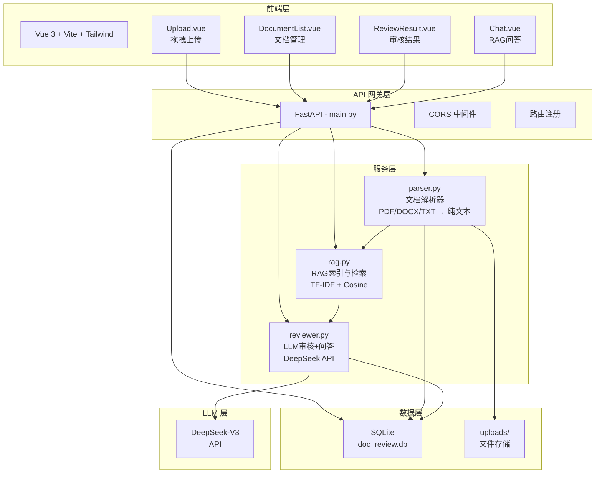

# Day 2：文档审核 v1.0 基础原型

> **学习目标**：理解企业文档审核的市场需求与产品设计方法，建立 AI 文档审核系统的全局架构认知，通过跑通原型和代码走读掌握各组件的角色与数据流转。
>
> **完成标志**：能画出系统完整架构图并解释数据流；能独立跑通原型并走读核心代码；能通过修改 Prompt 给系统增加一个新的审核维度。

---

## 本章阅读约定

本文使用以下四种标记帮助你高效阅读：

| 标记 | 含义 |
|------|------|
| > **提示**： | 帮助理解的补充信息、技巧分享 |
| > **注意**： | 需要特别留意的配置项、易出错的操作 |
| > **避坑**： | 前人踩过的坑，帮你绕开 |
| > **验证**： | 阶段性检查点，确认你做对了 |

文中命令统一使用 **macOS/Linux 终端** 和 **Windows PowerShell** 双标注。`<xxx>` 表示需要替换为你自己的实际内容。

---

## Day 2-4 学习地图

在开始今天的内容之前，先建立对接下来三天实训的整体认知：

```
Day 2 → "看全貌"
   了解AI文档审核系统的整体架构、业务流程和核心功能
   跑通 v1.0 原型，走读代码，理解每个组件"做什么、为什么、怎么流转"

Day 3 → "升级架构"
   基于 Day 2 的原型，进行 v1.0 → v2.0 架构升级
   引入 LangChain 编排审核流程，集成 PaddleOCR，实现模块化设计

Day 4 → "深度优化"
   RAG 分块策略优化（语义分块、层级分块、混合检索）
   Human-in-the-Loop 人机协同审核机制
```

> **提示**：今天下午你会反复听到"这个设计在 Day 3 会被升级""这里 Day 4 会优化"——这不是在留坑，而是在帮你建立**演进式架构**的思维。好系统不是一天设计出来的，是一步一步长出来的。

---

## 一、上午：产品调研与需求分析

> **上午目标**：建立对 AI 文档审核市场的全局认知，掌握产品需求分析方法论，完成全景技术选型评估。

### 1. 企业文档审核市场分析

在动手写第一行代码之前，先回答一个根本问题：**我们为什么要做这个系统？它解决谁的什么问题？**

#### 1.1 市场规模与典型场景

企业文档审核是 AI 落地最成熟的场景之一。根据 Gartner 2025 年报告，全球法律科技市场规模已超过 300 亿美元，其中 AI 文档审查是最核心的应用方向。

> **比喻**：文档审核就像工厂流水线上的质检环节——产品（合同/协议/标书）出厂前必须过一道关。传统质检靠老师傅一双眼睛，AI 质检等于给流水线装了 100 双永不疲劳的眼睛。

**典型场景全景：**

| 场景 | 文档类型 | 审核重点 | 痛点 |
|------|---------|---------|------|
| 法务合同审查 | 采购合同、服务协议、NDA | 合规风险、霸王条款、违约责任 | 法务部门人少活多，一份合同审 2-3 天 |
| 财务票据审核 | 发票、报销单、付款申请 | 金额一致性、合规性、重复报销 | 人工逐张核对，月结时加班到凌晨 |
| 标书合规检查 | 投标文件、资格证明 | 资质有效性、格式规范、评分点覆盖 | 废标风险，一个格式错误满盘皆输 |
| HR 入职文件 | 劳动合同、保密协议、竞业限制 | 条款完整性、法律合规 | 多地区法规不同，模板难以统一 |
| 采购供应链 | 供应商合同、质量协议 | 交付条款、验收标准、违约责任 | 供应商多、合同量大、条款差异大 |

> **提示**：这五个场景中，**法务合同审查**是需求最强、AI 效果最明显、商业价值最高的方向。这也是我们实训项目的切入点。

#### 1.2 法务合同审查的痛点与 AI 介入价值

以法务合同审查为典型，拆解 AI 到底能帮什么忙：

**人工审核的四大痛点：**

```
痛点 1：效率低下
  └── 一份 50 页的采购合同，资深法务需要 2-4 小时逐条审查
      一个月 100 份合同 → 一个法务根本审不过来

痛点 2：遗漏风险
  └── 人眼连续看 2 小时合同后注意力显著下降
      第 48 页的"违约金比例为 80%"可能被疲劳的眼睛略过

痛点 3：标准不一致
  └── 张律师对"不可抗力"条款的标准和李律师不一样
      同一份合同换人审，结果可能完全不同

痛点 4：知识不均衡
  └── 资深法务知道"争议解决地选被告所在地"是坑
      新人不知道，审完就放过去了
```

**AI 介入后的价值链条：**

| 价值维度 | AI 能做什么 | 效果 |
|---------|-----------|------|
| **提效** | 5 分钟完成初筛，标记出所有可疑条款 | 法务只需复审 AI 标记的 20% 内容 |
| **防漏** | 逐条扫描，零遗漏 | 不会因为疲劳或疏忽跳过风险条款 |
| **统一** | 同一套审核标准，结果可复现 | 所有合同用"同一把尺子"衡量 |
| **赋能** | 新人审合同，AI 给出风险提示和修改建议 | 把 3 年经验"压缩"进系统 |

> **比喻**：AI 文档审核 = 医院的"初筛分诊台"。AI 不是替代医生（法务），而是帮医生把明显没问题的和明显有问题的快速分开，让医生把精力集中在疑难杂症上。

#### 1.3 竞品分析

了解市面上已有的产品，既能验证需求真实存在，也能找到差异化方向。

| 产品 | 定位 | 优势 | 不足 |
|------|------|------|------|
| **Kira Systems** | 企业级合同分析 | 机器学习模型成熟，Deloitte 等大所使用 | 英文为主，价格高昂（年费 $10 万+） |
| **Luminance** | AI 法律文档审查 | 无监督学习，异常检测能力强 | 部署复杂，需要企业内部部署 |
| **e签宝 / 法大大** | 电子合同签署 + 智能审查 | 本土化强，中文支持好 | 审核深度有限，偏向签署流程 |
| **幂律智能** | 中文法律合同 AI 审查 | 专业法律知识图谱，中文模型优化 | 面向头部律所，中小企业门槛高 |
| **ChatGPT / Claude** | 通用 AI 文档分析 | 门槛低，打开网页就能用 | 无专业审核维度、无历史管理、数据安全存疑 |

**竞品分析启示：**

```
市场缺口：面向中小企业、中文、轻量部署、可私有化的文档审核工具

我们的定位 → RAG 文档审核系统（实训项目）：
  优势 1：DeepSeek API 成本极低（审一份合同几分钱）
  优势 2：TF-IDF 向量化无需 GPU，普通服务器即可运行
  优势 3：专注四大审核维度，结构化输出，可追溯原文
  优势 4：开源可定制，企业可根据自身规则库扩展
```

---

### 2. 产品功能定义

了解市场后，接下来定义产品——**我们的系统到底要做成什么样？**

#### 2.1 核心功能模块划分

> **提示**：功能模块划分遵循 **MECE 原则**——相互独立（Mutually Exclusive）、完全穷尽（Collectively Exhaustive）。每个模块职责清晰，不重叠不遗漏。

```
RAG 文档审核系统
├── 模块 1：文档管理
│   ├── 文件上传（拖拽/选择，PDF/DOCX/TXT）
│   ├── 文档列表（状态展示、筛选、排序）
│   └── 文档删除（级联删除审核数据和问答记录）
│
├── 模块 2：智能审核
│   ├── 四维度审核（合规风险 / 条款缺失 / 表述模糊 / 权益不对等）
│   ├── 三级风险评级（高 / 中 / 低）
│   └── 审核结果展示（卡片式、原文引用、修改建议）
│
├── 模块 3：文档问答
│   ├── RAG 检索增强（TF-IDF + Cosine Similarity）
│   ├── 对话式交互（AI 引用原文回答）
│   └── 建议问题快捷入口
│
└── 模块 4：系统基础
    ├── 健康检查
    └── 数据持久化（SQLite）
```

#### 2.2 用户故事地图

**用户故事（User Story）** 是 SDD 方法中 PRD 的核心组成部分。格式：`作为 <角色>，我希望 <功能>，以便 <价值>`

> **回忆 Day 1**：我们在 SDD 章节学过——用户故事用一句话定义"谁要什么、为什么"，验收标准用 Given/When/Then 定义"怎样算做完"。

**核心用户故事：**

```
角色：法务专员 小王
场景：周一早上收到 15 份供应商合同，需要周五前完成审核

故事 1：快速上传
  作为法务专员，
  我希望拖拽合同文件到页面上就能自动上传并解析，
  以便省去手动输入文件信息的麻烦。

故事 2：智能初筛
  作为法务专员，
  我希望系统自动从合规风险、条款缺失、表述模糊、权益不对等
  四个维度审查合同，并标注风险等级，
  以便我优先处理高风险条款。

故事 3：原文溯源
  作为法务专员，
  我希望每个风险项都能看到对应的原文片段，
  以便我快速定位并核实问题。

故事 4：随时提问
  作为法务专员，
  我希望针对合同内容随时提问（如"这份合同的违约责任是怎么约定的？"），
  系统能引用原文给我答案，
  以便不用逐页翻找。
```

#### 2.3 MVP 功能优先级排序

使用 **MoSCoW 方法** 排定 MVP 优先级：

| 优先级 | 标识 | 功能 | 理由 |
|--------|------|------|------|
| **Must Have** | 必须有 | 文档上传 + 解析、四维度审核、审核结果展示 | 没有这些不能叫"文档审核系统" |
| **Must Have** | 必须有 | 文档列表管理、文档删除 | 基础 CRUD 闭环 |
| **Should Have** | 应该有 | RAG 文档问答 | 核心竞争力，但非审核主流程 |
| **Could Have** | 可以有 | Markdown 渲染回答、建议问题按钮 | 体验优化，不影响核心价值 |
| **Won't Have** | 本次不做 | 用户登录、多用户权限、导出报告 | v1.1+ 迭代计划 |

> **避坑**：MVP 最大的敌人是"顺便也做一个吧"。每多一个 Should Have 功能，就多一个可能延期交付的风险点。

#### 2.4 成功要素

| 维度 | 指标 | v1.0 目标 |
|------|------|----------|
| 准确率 | AI 审核结果中真正有效的风险比例 | ≥ 80%（人工抽检） |
| 覆盖率 | 文档中存在的风险被 AI 发现的比率 | ≥ 70% |
| 响应时间 | 从触发审核到返回结果 | ≤ 30 秒 |
| 可用性 | 上传 → 审核 → 查看结果的流程走通率 | 100% |

---

### 3. 技术选型评估

> 这是上午最核心的模块。我们不急于锁定"实训项目用什么"，而是先做全景对比——了解市面上有什么选择、各自的优劣、以及我们做出某个选择的理由。这正是产品调研中技术选型的标准流程。

#### 3.1 多模态大模型能力对比

文档审核场景中，大模型是"大脑"。它不只是读取文本，在更高级的场景中还需要理解文档图像（扫描件中的表格、印章、签名）。因此我们需要对比的是**多模态**大模型。

| 模型 | 多模态支持 | 中文能力 | 上下文窗口 | API 价格（每百万 Token） | 国内可访问 |
|------|-----------|---------|-----------|----------------------|-----------|
| **GPT-4o** | 图/文/音 | ★★★☆ | 128K | 输入 $5 / 输出 $15 | 需代理 |
| **Claude 3.5 Sonnet** | 图/文 | ★★★★ | 200K | 输入 $3 / 输出 $15 | 需代理 |
| **Claude Opus 4.8** | 图/文 | ★★★★☆ | 200K | 输入 $5 / 输出 $25 | 需代理 |
| **DeepSeek-V3** | 文（纯文本） | ★★★★★ | 128K | 输入 ¥1 / 输出 ¥2 | ✅ 直连 |
| **Qwen-VL-Max** | 图/文/视频 | ★★★★★ | 128K | 输入 ¥20 / 输出 ¥60 | ✅ 直连 |
| **GLM-4V** | 图/文 | ★★★★☆ | 128K | 输入 ¥10 / 输出 ¥30 | ✅ 直连 |
| **Gemini 2.5 Pro** | 图/文/音/视频 | ★★★☆ | 1M+ | 输入 $1.25 / 输出 $10 | 需代理 |

> **提示**：多模态能力对于文档审核场景非常重要——真实的合同不只有文字，还有表格、印章、签名、批注。一个能直接"看懂"文档图像的模型，可以跳过 OCR 环节直接做语义理解。但成本也更高。

**v1.0 选型结论：DeepSeek-V3**

理由：
- 中文能力第一梯队，代码生成能力突出
- API 价格是 GPT-4o 的约 1/10，审一份合同成本几分钱
- 国内直连，无需代理，与 Claude Code 通过 Anthropic 兼容端点无缝集成
- 纯文本模型，v1.0 阶段处理的是数字文档（PDF/DOCX 中提取的文本），不需要多模态能力

> **Day 3 预告**：v2.0 引入扫描件处理时，会对比"多模态模型直接理解文档图像"vs"OCR 提取文本 + 纯文本模型审核"两种路线。

#### 3.2 OCR 引擎选型

当文档是扫描件或图片时，OCR（光学字符识别）是将图像转化为文本的必经之路。这是 AI 文档审核系统的"眼睛"。

| OCR 引擎 | 中文准确率 | 表格识别 | 印章/签名 | 部署复杂度 | 费用 |
|----------|-----------|---------|----------|-----------|------|
| **PaddleOCR** | ★★★★★ | ★★★★☆ | ★★★☆ | 中（pip install） | 免费 |
| **EasyOCR** | ★★★★☆ | ★★★☆ | ★★☆☆ | 低（pip install） | 免费 |
| **Tesseract** | ★★★☆☆ | ★★☆☆ | ★☆☆☆ | 低 | 免费 |
| **百度 OCR API** | ★★★★★ | ★★★★☆ | ★★★★☆ | 低（API调用） | ¥0.01~0.05/页 |
| **腾讯 OCR API** | ★★★★★ | ★★★★☆ | ★★★★☆ | 低（API调用） | ¥0.01~0.05/页 |
| **讯飞 OCR API** | ★★★★★ | ★★★★★ | ★★★★★ | 低（API调用） | ¥0.02~0.08/页 |

**v1.0 选型结论：PyPDF2 + python-docx（数字文档文本提取），暂不引入 OCR**

理由：
- v1.0 处理的是 PDF/DOCX/TXT 格式的数字文档，文本可以直接从文件中提取，不需要 OCR
- 跳过 OCR 降低了 v1.0 的复杂度，先把精力聚焦在"审核逻辑"这个核心价值链上
- PyPDF2 和 python-docx 是 Python 生态最成熟的文档处理库，安装简单、文档丰富

#### 3.3 本地部署 vs 云端 API 成本分析

这是技术选型中最"接地气"的环节——不只是技术能力对比，还要算经济账。

**方案 A：云端 API（DeepSeek / GLM / 千问）**

| 项目 | 计算方式 | 月成本 |
|------|---------|--------|
| LLM 调用（100 份合同审核 + 500 轮问答） | 约 50 万输入 Token + 20 万输出 Token | **约 ¥0.9（DeepSeek）** |
| 服务器（2 核 4GB 云服务器） | 按需付费 | **约 ¥100** |
| 运维 | 零 | **¥0** |
| **合计** | | **约 ¥101/月** |

**方案 B：本地部署（Ollama + Qwen 3 7B）**

| 项目 | 计算方式 | 月成本 |
|------|---------|--------|
| 硬件（T4 GPU 云服务器，16GB 显存） | 包月 | **约 ¥2000~4000** |
| 运维（模型更新、监控、故障处理） | 约 0.1 人天/月 | **约 ¥1000** |
| 电费 | 忽略不计 | — |
| **合计** | | **约 ¥3000~5000/月** |

**方案 C：混合方案（推荐）**

```
开发/测试环境 → 云端 DeepSeek API（成本低、零运维）
      +
生产环境（数据敏感） → 本地 Qwen 3 7B（数据不出企业内网）
      +
高精度场景 → 云端 Claude Opus 4.8（按需调用，不差那几分钱）
```

**v1.0 选型结论：纯云端 API（DeepSeek）**

理由：实训阶段以学习和快速验证为主，云端 API 零运维、低成本、模型能力随官方升级自动提升。Day 4 将体验本地部署 Qwen 做私有化审核。

#### 3.4 开源大模型选型

当企业因为数据安全要求必须私有化部署时，开源模型是唯一选择。以下是当前主流的开源中文大模型：

| 模型 | 参数规模 | 中文能力 | 最低 GPU 显存 | 社区活跃度 | 协议 |
|------|---------|---------|-------------|-----------|------|
| **Qwen 3** | 0.6B / 1.8B / 7B / 33B / 72B | ★★★★★ | 2GB ~ 144GB | ⭐⭐⭐⭐⭐ | Apache 2.0 |
| **DeepSeek-V3** | 671B（MoE，激活 37B） | ★★★★★ | 80GB+ | ⭐⭐⭐⭐ | MIT |
| **Llama 4** | Scout 17B / Maverick 17B | ★★★☆☆ | 16GB ~ 32GB | ⭐⭐⭐⭐⭐ | Llama 社区许可 |
| **ChatGLM** | 6B / 9B | ★★★★☆ | 8GB ~ 16GB | ⭐⭐⭐ | 开源 / 商用需授权 |
| **Yi** | 6B / 9B / 34B | ★★★★☆ | 8GB ~ 68GB | ⭐⭐ | Apache 2.0 |

**选型分析：**

```
如果你有一台带 8GB 显存的普通电脑：
  → Qwen 3 7B（Q4 量化版）是最佳选择
    中文能力优秀，社区最活跃，Apache 2.0 协议最友好

如果你有一台带 24GB 显存的工作站：
  → Qwen 3 33B 或 DeepSeek-V3 量化版
    能力接近云端模型，处理复杂审核 Prompt 更稳定

如果你有企业级 GPU 集群：
  → Qwen 3 72B 或 DeepSeek-V3 全量
    能力达到云端一线水平，适合大规模生产部署
```

> **Day 4 预告**：我们会在 Day 4 体验用 Ollama 本地部署 Qwen 3 7B，用它来审核一份"不能上传到云端"的敏感合同。你会直观感受到本地模型和云端模型的差异——能力差多少？速度差多少？

#### 3.5 v1.0 技术选型总览

经过四轮评估，锁定 v1.0 技术栈：

| 层级 | v1.0 选型 | 为什么不是另一种选择 |
|------|----------|-------------------|
| LLM | **DeepSeek-V3（云端 API）** | 不是 GPT-4o（贵 10 倍+需代理）；不是 Qwen 本地（Day 4 才引入） |
| 文档提取 | **PyPDF2 + python-docx** | 不是 OCR（v1.0 不处理扫描件，Day 3 引入 PaddleOCR） |
| 向量检索 | **TF-IDF + Cosine Similarity** | 不是 ChromaDB（Python 3.9 兼容问题）；不是 Embedding 模型（需 GPU） |
| 后端 | **FastAPI + SQLite** | 不是 Django（太重）；不是 PostgreSQL（v1.0 单机足够） |
| 前端 | **Vue 3 + Vite + Tailwind** | 不是 React（Vue 上手更快，实训时间紧） |

> **提示**：这套技术栈的核心理念——**最轻的方案解决最核心的问题**。没有 GPU、没有 Docker、没有向量数据库，一个 `pip install` + 一个 `npm install` 就能跑起来。

**上午小结：**

```
上午完成的三件事：
  市场分析 → 确认需求真实存在，找到市场缺口
  产品定义 → 明确了 MVP 范围和用户故事
  技术选型 → 全景对比了多模态LLM、OCR引擎、部署方式、开源模型
            不只是"我们选了什么"，更关键的是"为什么这样选"
            以及"那些没选的技术，在什么场景下会成为更好的选择"

下午要做的事：
  不是从零写代码，而是先看全貌、再跑起来、再拆开看——
  架构全景认知 → 原型跑通体验 → 代码深度走读 → 动手改造实验
```

---

## 二、下午：SDD 驱动原型开发

> **下午目标**：遵循 **SDD（Specification-Driven Development）** 开发范式，全程使用 Claude Code，基于 PRD.md 将文档审核系统从零开发出来。**先规范，后编码；Plan Mode 出方案，Normal Mode 写代码，每个模块 Git 存档。**

### SDD 开发总览

在动手之前，先回顾 Day 1 学的 SDD 核心流程：

```
PRD.md（已有）→ Plan Mode 生成 SPEC → Normal Mode 编码实现
     ↓                    ↓                    ↓
  需求输入            只读规划              逐步执行
                  不改文件不跑命令       每步 Git commit
```

> **回忆 Day 1**：Day 1 第 3 节教了 SDD——规范就是你和 AI 之间的"合同"。第 6.3 节教了三种运行模式——Plan Mode 只读规划、Normal Mode 逐步确认、Auto-Accept 高效执行。第 6.4.3 节教了黄金法则——**在让 AI 做大修改之前，先 commit**。今天下午，这些全部用上。

---

### 4. SDD 第一步：从 PRD 到 SPEC + 项目基础设施

> **目标**：用 Plan Mode 把 PRD 变成可执行的技术方案，搭好项目骨架和 AI 基础设施。在写第一行业务代码之前，让 Claude Code 充分理解这个项目。

#### 4.1 用 Plan Mode 将 PRD 转化为 SPEC

这是下午最关键的一步。你手里有一份完整 PRD（`PRD.md`），但直接让 AI"帮我做一个文档审核系统"太模糊了。你需要先把 PRD 翻译成 AI 能精准执行的技术规范 SPEC。

**Step 1：创建项目目录并准备 PRD**

**通用：**
```bash
$ mkdir rag-doc-review
$ cd rag-doc-review
```

把 `PRD.md` 复制到项目根目录。

**Step 2：进入 Plan Mode**

**通用：**
```bash
$ claude --permission-mode plan
```

或启动后输入 `/plan`。

> **验证**：终端顶部显示 "Plan Mode"，AI 只能读文件、不能写文件。

**Step 3：Plan Mode 生成 SPEC**

在 Plan Mode 中，让 AI 根据 PRD 生成技术规范：

```
我正在开发一个 RAG 文档审核系统。请先阅读项目根目录的 PRD.md。

请帮我生成 SPEC.md（技术规范文档），先展示给我审查，确认后再写入： 
- 系统架构图（Mermaid）
- 技术选型：结合上午的选型结论（DeepSeek + TF-IDF + FastAPI + Vue 3）
- 数据模型：根据 PRD 功能需求中的验收标准，推断需要哪些表和字段
- API 接口：根据功能需求和验收标准，设计对应的 RESTful 端点
- 项目目录结构：前后端分离，backend/app 分层（routers/services/models）
```

> **提示**：Plan Mode 下 AI 只读不写。你可以大胆让它探索 PRD.md、设计方案，不用担心改坏任何文件。

**Step 4：审查 SPEC 方案**

AI 展示方案后，重点检查：
- [ ] 数据模型是否覆盖了功能需求中涉及的所有实体（文档/审核/问答）？
- [ ] API 端点是否覆盖了验收标准中描述的所有操作？
- [ ] 目录结构是否清晰分层（routers/services/models）？

确认无误后退出 Plan Mode（`Shift+Tab` 切换到 Normal Mode），让 AI 写入 `SPEC.md`。

> **验证**：项目根目录下应有 `SPEC.md`。

**Step 5：创建项目 CLAUDE.md**

退出 Plan Mode 后，在 Normal Mode 中创建项目级 CLAUDE.md。回想 Day 1 讲的——全局 CLAUDE.md 已经在 Day 1 创建好了，现在创建的是项目专属的"说明书"。

```
请参考 SPEC.md，帮我生成项目根目录的 CLAUDE.md：
- 项目概述（一句话）
- 技术栈（前后端分别列出）
- 目录结构说明
- 编码规范：Python 用 snake_case，Vue 组件用 PascalCase
- 当前开发状态：项目初始化阶段
```

**Step 6：用 Claude Code 创建项目 .claude/settings.json**

```
请在 .claude/ 目录下创建 settings.json：

- allow 白名单（日常安全操作，不再每次弹窗确认）：
  Read、Write、Edit、Glob、Grep
  Bash(npm *)、Bash(pip *)、Bash(git *)、Bash(mkdir *)、Bash(python *)、Bash(node *)

- deny 黑名单（安全红线，即使在 auto-accept 模式下也会阻止）：
  Bash(rm -rf *)、Bash(sudo *)
  Read(**/.env*)、Read(**/*.pem)、Read(**/*.key)
  Bash(git push *)、Bash(git rebase *)
```

> **验证**：项目根目录下应有 `SPEC.md`、`CLAUDE.md`、`.claude/settings.json`。三个文件分别由三次独立的 Claude Code 对话生成。

#### 4.2 项目骨架初始化

有了 SPEC，开始搭骨架。

**让 Claude Code 创建项目结构：**

```
请按 SPEC.md 中的目录结构，帮我创建项目骨架：

1. 创建 backend/ 目录及所有子目录
2. 生成 backend/requirements.txt，内容如下：
   fastapi==0.115.6
   uvicorn[standard]==0.34.0
   sqlalchemy==2.0.36
   python-multipart==0.0.18
   pypdf2==3.0.1
   python-docx==1.1.2
   scikit-learn==1.5.2
   openai==1.57.4
   httpx==0.27.2
   python-dotenv==1.0.1

3. 创建 backend/.env 模板：
   DEEPSEEK_API_KEY=<你的API Key>
   DEEPSEEK_BASE_URL=https://api.deepseek.com/v1

4. 用 Vite 创建 frontend/ 项目（Vue 3 + TypeScript）

5. 生成 .gitignore（排除 .env、node_modules、__pycache__、*.db、uploads/）
```

> **避坑**：httpx 必须 < 0.28——0.28 版本移除了 openai SDK 依赖的 `proxies` 参数，会导致 API 调用报错。

**安装依赖：**

**通用：**
```bash
$ cd backend && pip install -r requirements.txt
$ cd frontend && npm install && npm install tailwindcss @tailwindcss/vite
```

**配置 DeepSeek API Key：**

在 `backend/.env` 中填入你的实际 Key。

**配置前端代理：**

让 Claude Code 生成 `frontend/vite.config.ts`，内容参考 PRD：
```typescript
import { defineConfig } from 'vite'
import vue from '@vitejs/plugin-vue'
import tailwindcss from '@tailwindcss/vite'

export default defineConfig({
  plugins: [vue(), tailwindcss()],
  server: {
    proxy: {
      '/api': {
        target: 'http://localhost:8000',
        changeOrigin: true,
      },
    },
  },
})
```

✅ **Git 存档点 1**：

**通用：**
```bash
$ git init && git add . && git commit -m "项目初始化：SPEC + CLAUDE.md + 骨架搭建 + AI 基础设施"
```

> **验证**：
> ```bash
> $ git log --oneline
> $ ls
> backend/  frontend/  SPEC.md  CLAUDE.md  PRD.md  .claude/  .gitignore
> ```

---

### 5. SDD 第二步：后端核心功能开发

> **目标**：自底向上完成整个后端——数据模型 → RAG 服务 → API 端点。每个模块的流程是：**Claude Code 生成代码 → 你审查 → 跑验证命令 → Git 存档**。

#### 5.1 数据模型层

**Claude Code Prompt：**

```
请严格按照 SPEC.md 中的数据模型设计，帮我生成三个文件：

1. backend/app/config.py：
   - 用 pydantic-settings 的 BaseSettings 读取 .env
   - 读取 DEEPSEEK_API_KEY 和 DEEPSEEK_BASE_URL
   - 数据库路径默认 backend/data/doc_review.db
   - 上传目录默认 backend/data/uploads/

2. backend/app/database.py：
   - 用 SQLAlchemy 创建 SQLite 引擎
   - 提供 get_db() 依赖注入函数（yield session）
   - 引擎 echo=False

3. backend/app/models.py：
   按 SPEC.md 的数据模型创建所有表，核心实体包括：
   - Document：id, filename, file_type, file_size, status（uploaded→parsing→ready→parse_failed）, review_status（pending→reviewing→completed）, upload_time, content_summary
   - Review：id, document_id(FK→Document), review_time, status, total_items, risk_count, summary
   - ReviewItem：id, review_id(FK→Review), category（合规风险|条款缺失|表述模糊|权益不对等）, severity（high|medium|low）, title, description, suggestion, source_text
   - ChatSession：id, document_id(FK→Document), created_at
   - ChatMessage：id, session_id(FK→ChatSession), role（user|assistant）, content, created_at
   使用 Base.metadata.create_all 在启动时自动建表。
```

> **避坑**：SQLite 不原生支持 UUID，Document ID 用 `Integer` 自增主键，简单直接。

审查代码后，验证：

**通用：**
```bash
$ cd backend
$ python -c "from app.database import engine; from app.models import Base; Base.metadata.create_all(bind=engine); print('OK')"
```

> **验证**：输出 "OK"，`backend/data/doc_review.db` 已生成。

✅ **Git 存档点 2**：

**通用：**
```bash
$ git add . && git commit -m "数据模型层：config + database + models（五张表）"
```

#### 5.2 文档解析与 RAG 服务

**Claude Code Prompt：**

```
请帮我生成两个服务文件：

1. backend/app/services/parser.py：
   - 支持 PDF（PyPDF2）、DOCX（python-docx）、TXT 三种格式
   - 根据文件后缀名自动选择解析器
   - 返回解析后的纯文本字符串
   - 解析失败抛出自定义异常 ParseError

2. backend/app/services/rag.py：
   - 文本分块：参考 langchain 的 RecursiveCharacterTextSplitter 实现
     参数 chunk_size=500, overlap=100
   - build_index(text)：分块 + sklearn TfidfVectorizer(analyzer='char_wb') + 向量化
   - retrieve_context(query, top_k=5)：query 向量化 + cosine_similarity 计算
     返回 top_k 个 {content, score} 的列表
   - get_chunks()：返回所有文本块

注意：analyzer='char_wb' 对中文做字符级 n-gram，不需要额外安装 jieba。
analyzer='char_wb' 对中文做字符级 n-gram 切分，不需要额外安装分词库。
```

审查代码后，验证 RAG 服务：

**通用：**
```bash
$ cd backend
$ python -c "
from app.services.rag import RAGService
rag = RAGService()
text = '甲方应在收到货物后30个工作日内完成验收。违约责任：逾期付款按日万分之五计收违约金。'
rag.build_index(text)
results = rag.retrieve_context('违约责任')
for r in results:
    print(f'{r[\"score\"]:.3f} | {r[\"content\"][:60]}')
"
```

> **验证**：输出中第一条结果应包含"违约责任"，且相似度最高。

✅ **Git 存档点 3**：

**通用：**
```bash
$ git add . && git commit -m "RAG服务：parser.py + rag.py（TF-IDF + Cosine）"
```

#### 5.3 文档上传与管理 API

**Claude Code Prompt：**

```
请帮我生成以下文件，严格按 SPEC.md 中的 API 接口设计：

1. backend/app/schemas.py：
   - DocumentResponse、DocumentListResponse
   - ReviewResponse（含 items 列表）、ReviewItemResponse
   - ChatRequest（question 字段）、ChatResponse（answer + session_id）
   - 所有模型用 orm_mode = True

2. backend/app/routers/documents.py：
   - POST /api/documents/upload：multipart/form-data，字段名 file
     流程：校验文件类型（仅 PDF/DOCX/TXT）→ 保存到 uploads/ → parser 解析
     → rag 构建索引 → 写入 Document 表（status=ready）→ 返回文档信息
   - GET /api/documents：列表，按 upload_time 降序
   - GET /api/documents/{doc_id}：单文档详情
   - DELETE /api/documents/{doc_id}：级联删除文档 + 关联的 Review/ReviewItem/ChatSession/ChatMessage

3. 更新 backend/app/main.py：
   - CORS 中间件（allow_origins=["*"]，实训阶段）
   - 注册 documents 路由
   - GET /api/health 健康检查
   - 启动时 create_all 建表
```

审查代码后，验证：

**通用：**
```bash
$ cd backend
$ uvicorn app.main:app --reload
```

浏览器打开 http://localhost:8000/docs ，确认以下端点可见：
- `POST /api/documents/upload`
- `GET /api/documents`
- `GET /api/documents/{doc_id}`
- `DELETE /api/documents/{doc_id}`
- `GET /api/health`

✅ **Git 存档点 4**：

**通用：**
```bash
$ git add . && git commit -m "文档管理API：upload + list + detail + delete"
```

#### 5.4 文档审核与问答 API

**Claude Code Prompt：**

```
请帮我生成以下文件：

1. backend/app/services/reviewer.py - LLM 审核与问答服务：
   使用 openai SDK 连接 DeepSeek（base_url 和 api_key 从 config 读取）
   
   review_document(full_text, chunks)：
   - 构建 Prompt，要求从四个维度审核：
     · 合规风险：违反法律法规、行业标准
     · 条款缺失：缺少保密/违约责任/争议解决等保护性条款
     · 表述模糊：含义不清晰、容易歧义
     · 权益不对等：权利义务明显不对等
   - 要求 LLM 返回 JSON：
     { "summary": "...", "items": [{ "category": "合规风险|条款缺失|表述模糊|权益不对等", 
       "severity": "high|medium|low", "title": "...", "description": "...", 
       "suggestion": "...", "source_text": "..." }] }
   - JSON 容错：用 re.findall(r'\{[\s\S]*\}', response) 提取 + json.loads，失败时打印原始响应
   
   chat(chunks, question, history)：
   - 将相关文本块 + 最近 4 轮对话历史作为 context
   - 构建 Prompt，要求基于文档内容回答、引用原文

2. backend/app/routers/review.py：
   - POST /api/documents/{doc_id}/review：触发审核
     流程：status=ready → review_status=reviewing → reviewer.review_document()
     → 解析 JSON → 写入 Review + ReviewItem（N条）→ review_status=completed
   - GET /api/documents/{doc_id}/review：返回最新审核记录

3. backend/app/routers/chat.py：
   - POST /api/documents/{doc_id}/chat：{ "question" }
     流程：RAG 检索 top-5 → 获取最近4轮历史 → reviewer.chat() → 写入消息 → 返回
   - GET /api/documents/{doc_id}/chat/history：返回对话历史

4. 更新 backend/app/main.py，注册 review 和 chat 路由
```

审查后启动后端验证：

**通用：**
```bash
$ uvicorn app.main:app --reload
```

打开 http://localhost:8000/docs ，确认 9 个端点全部可见。

✅ **Git 存档点 5**：

**通用：**
```bash
$ git add . && git commit -m "审核与问答API：reviewer.py + review路由 + chat路由"
```

---

### 6. SDD 第三步：前端页面开发

> **目标**：基于 PRD 第 3.2 节的样式规范，完成四个前端页面。全程 Claude Code 生成 → 审查 → 验证。

#### 6.1 布局框架与 API 封装

**Claude Code Prompt：**

```
请按 PRD.md 第 3.2 节的前端样式规范，帮我生成前端基础设施：

1. frontend/src/style.css - 全局样式：
   - 深色主题，背景 #0D1117
   - 强调色 #58A6FF
   - 卡片背景 #161B22
   - 边框色 #30363D
   - 字体：系统默认无衬线
   - 滚动条美化

2. frontend/src/api/index.ts - Axios 封装：
   - baseURL: ''（Vite proxy 转发到 localhost:8000）
   - 封装：uploadDocument / getDocuments / getDocument / deleteDocument
          triggerReview / getReviewResult / sendMessage / getChatHistory

3. frontend/src/router/index.ts：
   - / → 重定向到 /documents
   - /upload → Upload.vue
   - /documents → DocumentList.vue
   - /documents/:id/review → ReviewResult.vue
   - /documents/:id/chat → Chat.vue

4. frontend/src/App.vue - 主布局：
   - 固定左侧导航栏 240px，背景 #161B22，边框右侧 #30363D
   - 导航项：上传文档、文档列表
   - 主内容区 margin-left: 240px，padding: 32px
```

> **验证**：`cd frontend && npm run dev`，确认侧边栏渲染正确、四个路由可访问。

✅ **Git 存档点 6**：

**通用：**
```bash
$ git add . && git commit -m "前端布局：侧边栏 + 路由 + API封装 + 深色主题"
```

#### 6.2 文档上传与管理页面

**Claude Code Prompt：**

```
请实现两个页面：

1. frontend/src/views/Upload.vue：
   - 中央拖拽上传区，虚线边框 #30363D，hover 高亮 #58A6FF
   - 支持点击选择文件（隐藏 input[type=file]）
   - 前端校验文件类型（.pdf/.docx/.txt），不符合弹 Toast 提示
   - 上传中显示三点动画
   - 上传成功显示文档名 + "已索引 N 个文本块"
   - 成功后提供跳转按钮：去审核、去问答

2. frontend/src/views/DocumentList.vue：
   - 卡片式列表，背景 #161B22，边框 #30363D
   - 每项显示：文件名、大小、时间、状态标签
   - 状态标签颜色：ready=绿色, parsing=蓝色, parse_failed=红色
   - 审核状态标签：pending=灰色, reviewing=黄色, completed=绿色
   - 操作按钮：审核、问答、删除
   - 空状态：引导文案 + 跳转上传页按钮
```

✅ **Git 存档点 7**：

**通用：**
```bash
$ git add . && git commit -m "文档管理页面：Upload.vue + DocumentList.vue"
```

#### 6.3 审核结果与问答页面

**Claude Code Prompt：**

```
请实现两个页面：

1. frontend/src/views/ReviewResult.vue：
   - 页面头部：文档名 + 审核时间 + 总问题数 + 高风险数
   - 审核总结卡片（左侧 #58A6FF 边框）
   - 风险项卡片列表，按 severity 降序
     每个卡片左侧彩色边框：high=#F85149, medium=#D29922, low=#58A6FF
     头部：等级标签 + 分类标签
     正文：description
     原文引用区（背景 #0D1117，斜体）
     修改建议区（绿色，前缀 ✅）
   - "重新审核"按钮
   - 加载态：三点动画 + "正在审核中..."
   - 空状态：未审核时显示"发起审核"按钮

2. frontend/src/views/Chat.vue：
   - 页面头部：文档名
   - 首次进入：4个建议问题按钮
   - 对话区：用户消息右对齐（#58A6FF），AI 回复左对齐（#161B22）
   - Markdown 渲染 AI 回复
   - 底部输入区：输入框 + 发送按钮
   - 加载态：三点动画
```

✅ **Git 存档点 8**：

**通用：**
```bash
$ git add . && git commit -m "审核与问答页面：ReviewResult.vue + Chat.vue"
```

---

### 7. SDD 第四步：前后端联调与端到端验证

> **目标**：前后端同时启动，用真实数据走通全流程。

#### 7.1 启动前后端

**终端 1 - 后端：**
```bash
$ cd backend && uvicorn app.main:app --reload
```

**终端 2 - 前端：**
```bash
$ cd frontend && npm run dev
```

#### 7.2 端到端验证四步走

**第一步：上传测试文档**

先让 Claude Code 帮你生成一份测试合同：

```
> 请帮我生成一份约 2000 字的中文采购合同文本，保存到 backend/test_contract.txt。
  包含：甲乙双方信息、合同金额、交付期限、验收标准、违约责任、争议解决。
  故意在合同中埋 3 个坑：违约责任只约束乙方、验收标准模糊、缺少保密条款。
```

然后在 http://localhost:5173/upload 上传，确认：
- [ ] 上传成功，显示"已索引 N 个文本块"
- [ ] 文档列表中出现新文档，状态为"就绪"

**第二步：触发审核**

- 点击"审核"按钮
- 等待 20-30 秒
- 确认审核结果包含：
  - [ ] summary（审核总结，1-2 句话）
  - [ ] items 列表（四维度分类 + 三级风险等级）
  - [ ] 高风险项排在最前面
  - [ ] 每个风险项含原文引用和修改建议

**第三步：文档问答**

- 点击"问答"，确认显示 4 个建议问题
- 输入"这份合同有哪些风险？"
- 确认 AI 回复引用了文档内容
- 追问 2-3 轮，确认上下文记忆生效

**第四步：删除文档**

- 回到列表页，删除文档
- 确认文档从列表消失
- 在 Swagger GET /api/documents 中确认已删除

✅ **最终存档**：

**通用：**
```bash
$ git add . && git commit -m "v1.0 原型完成：前后端联调，四大功能全部验证通过"
```

#### 7.3 联调常见问题速查

| 症状 | 可能原因 | 解决方式 |
|------|---------|---------|
| 前端 404 | Vite proxy 未生效 | 检查 `vite.config.ts` proxy target 是否指向 8000 |
| 上传后一直"解析中" | 后端解析异常 | 查看后端终端日志 |
| 审核返回"审核失败" | DeepSeek API Key 无效 | 检查 `.env` 中 Key 是否正确 |
| 审核 JSON 解析失败 | DeepSeek 返回格式瑕疵 | 检查 reviewer.py 中的容错正则 |
| CORS 错误 | 中间件未配置 | 确认 main.py 中 allow_origins=["*"] |

> **提示**：联调遇到报错不要慌——这是 AI 编程最锻炼人的时刻。直接把**完整报错信息 + 相关文件**发给 Claude Code："帮我分析这个错误，定位原因并修复"。

---

### 下午总结：SDD 全流程回顾

```
今天下午你用 SDD 范式完成了：

  Plan Mode → SPEC.md + CLAUDE.md + settings.json
     ↓
  Normal Mode → 数据模型 → RAG服务 → 文档API → 审核问答API
     ↓
  Normal Mode → 布局框架 → 上传/列表页 → 审核/问答页
     ↓
  端到端联调验证 → 全部通过

全程 Claude Code 生成代码，你负责审查和验证，Git 存档 9 次。
这 9 个 commit 不仅仅是"备份"——它们是你今天下午的"学习轨迹"，
每一个 commit 都代表你对系统一个模块的理解和掌握。

明天 Day 3，你会在这个原型基础上进行架构升级——
引入 LangChain 编排、PaddleOCR 集成，把"小原型"变成"工业级系统"。
今晚的作业就是巩固今天下午的成果。
```

### 下午路线图

```
模块四：架构全景认知（40 分钟）
  ├── 4.1 系统整体架构讲解 —— 分层图、数据流、组件角色
  └── 4.2 架构演进路线图 —— Day 2→3→4 怎么演变

模块五：原型跑通与深度拆解（80 分钟）
  ├── 5.1 拉取代码 & 环境配置 —— 把系统跑起来
  ├── 5.2 代码走读：后端核心链路 —— parser → rag → reviewer → models
  ├── 5.3 代码走读：前端页面与交互 —— App → Upload → Review → Chat
  └── 5.4 动手实验：改一个功能 —— 增加审核维度，看效果

模块六：架构讨论与 Day 3 预热（30 分钟）
  ├── 6.1 v1.0 的局限性 —— 自己发现"哪里不够好"
  └── 6.2 Day 3 预告 —— 这些问题正是明后天要解决的
```

---

### 4. 模块四：AI 文档审核系统架构全景

#### 4.1 系统整体架构讲解

先看全局，再看局部。下面是 v1.0 系统的完整架构图：



> **提示**：这张图值得花 5 分钟仔细看。不要急着往下翻——先试着回答：如果用户上传一份 PDF，数据依次经过了哪些组件？每个组件做了什么转换？

**核心数据流：两条关键链路**

**链路 1：文档上传 → 索引就绪**

```
用户拖拽 PDF
    ↓
Upload.vue → POST /api/documents/upload (multipart/form-data)
    ↓
main.py → routers/documents.py
    ↓
parser.py: 提取纯文本（PyPDF2/Python-docx）
    ↓
rag.py: 文本分块（chunk_size=500, overlap=100）
    → TF-IDF 向量化 → 构建索引矩阵
    ↓
models.py: 写入 Document 表，status=ready
    ↓
返回：{ id, filename, status: "ready", message: "已索引 N 个文本块" }
```

**链路 2：触发审核 → 返回结果**

```
用户点击"审核"按钮
    ↓
ReviewResult.vue → POST /api/documents/{id}/review
    ↓
routers/review.py: 读取文档全文 + 所有文本块
    ↓
reviewer.py: 构建 Prompt（四维度审核要求 + 结构化输出格式）
    → 调用 DeepSeek API
    → 容错解析 JSON 响应
    ↓
models.py: 写入 Review + ReviewItem（N 条）
    ↓
返回：{ summary, items: [...], total_items, risk_count }
```

**各组件角色与职责：**

| 组件 | 比喻 | 输入 | 输出 | 核心代码 |
|------|------|------|------|---------|
| **parser.py** | 翻译官 | PDF/DOCX/TXT 文件 | 纯文本字符串 | PyPDF2, python-docx |
| **rag.py** | 图书管理员 | 纯文本 | 分块 + TF-IDF 索引 + 检索接口 | sklearn TfidfVectorizer |
| **reviewer.py** | 法务顾问 | 文本 + Prompt | LLM 审核结果（JSON） | openai SDK → DeepSeek |
| **models.py** | 档案室 | Python 对象 | 数据库记录 | SQLAlchemy ORM |
| **routers/*.py** | 前台接待 | HTTP 请求 | HTTP 响应 | FastAPI |

**技术决策 "Why"：**

> 以下问题是下午代码走读时常被问到的，先在这里回答。

**Q1：为什么 v1.0 用 TF-IDF 而不用向量数据库（ChromaDB/Milvus）？**

A：实训方案第 6 节有记载——ChromaDB 的 ONNX embedding 在 Python 3.9 上有兼容性问题，且 sentence-transformers 模型依赖 torch（>2GB）。TF-IDF 是纯统计方法，不依赖任何模型，对于文档级关键词检索（"违约责任""验收标准"）精度足够。Day 4 会升级为多策略 RAG。

**Q2：为什么用 SQLite 而不是 PostgreSQL？**

A：SQLite 是文件级数据库，零配置，一个 `.db` 文件就是全部数据。v1.0 是单机原型，不需要并发连接池和主从复制。等 v2.0（Day 3）多任务并发场景时，换 PostgreSQL 只是改一行 `database.py` 的 connection string。

**Q3：为什么文档文本要分块（chunk）？**

A：LLM 的上下文窗口有限，一份 200 页的合同不可能一次性发给 LLM 审核。把文档切成 500 字一块，审核时选取最相关的 N 块发给 LLM，既能控制 Token 成本，又能让 LLM 聚焦在相关内容上。overlap=100 是为了防止关键信息刚好被切在边界上。

#### 4.2 架构演进路线图

这不是最终的架构。v1.0 是故意"留有余地"的——让你在 Day 3、Day 4 有明确的升级方向。

```
Day 2 v1.0：单体原型
├── 架构：脚本式流程，一个 reviewer.py 搞定审核
├── 检索：TF-IDF 关键词匹配
├── 文档：仅支持数字文档（PDF/DOCX/TXT）
├── 部署：本地单进程，SQLite
└── 审核：纯 LLM，无人工介入

        ↓ Day 3 升级方向

Day 3 v2.0：模块化架构
├── 架构：LangChain Chain 编排审核流程
├── 检索：保留 TF-IDF，增加规则库检索
├── 文档：引入 PaddleOCR 处理扫描件
├── 部署：模块化目录结构，支持多任务并发
└── 审核：可插拔的审核步骤（解析 → 初审 → 合规比对 → 报告）

        ↓ Day 4 升级方向

Day 4 v3.0：企业级优化
├── 检索：多策略 RAG（语义分块 + 层级分块 + 混合检索）
├── 规则：自定义规则库（法规/行业标准/企业模板）
├── 协同：Human-in-the-Loop 人机协同审核
└── 部署：本地 Qwen 7B 私有化部署
```

> **提示**：下午做代码走读时，带着这张演进图去看每个组件。问自己：**这个组件在 Day 3 会被怎么改造？Day 4 会被怎么优化？** 这种"带着演进视角看代码"的思维，是架构师和普通开发者的分水岭。

---

### 5. 模块五：原型跑通与深度拆解

#### 5.1 拉取原型代码 & 环境配置

> **注意**：下午的代码以项目 zip 包或 Git 仓库的形式提供。你的任务不是从零搭建，而是**跑起来、读懂它、改一改**。

**Step 1：获取代码**

代码通过以下方式获取：
- Git 仓库地址 → `git clone <仓库地址>`
- 项目 zip 包 → 解压到工作目录

**Step 2：用 Claude Code 快速理解项目**

**通用：**
```bash
$ cd rag-doc-review
$ claude
```

进入 Claude Code 后，先让它帮你建立全局认知：

```
> 请阅读 CLAUDE.md 和 SPEC.md，用 5 句话总结这个项目的：
  1. 做什么
  2. 用什么技术栈
  3. 项目目录结构
  4. 核心数据流
  5. 有哪些 API 端点
```

> **提示**：这是一个很实用的技巧——进入一个新项目，不要一上来就逐文件看。先让 AI 帮你提取"项目骨架"，建立全局认知后再深入细节。

**Step 3：配置环境变量**

在 `backend/.env` 中：

```bash
DEEPSEEK_API_KEY=<你的 DeepSeek API Key>
DEEPSEEK_BASE_URL=https://api.deepseek.com/v1
```

**Step 4：安装依赖并启动**

**后端（终端 1）：**

```bash
$ cd backend
$ pip install -r requirements.txt
$ uvicorn app.main:app --reload
```

浏览器打开 http://localhost:8000/docs ，确认 Swagger 页面显示所有 API。

**前端（终端 2）：**

```bash
$ cd frontend
$ npm install
$ npm run dev
```

浏览器打开 http://localhost:5173 ，确认深色主题侧边栏正常显示。

**Step 5：跑通全流程**

准备一份测试合同（让 Claude Code 帮你生成）：

```
> 请帮我生成一份简单的采购合同文本（约 2000 字），包含以下条款：
  甲方乙方信息、合同金额、交付期限、验收标准、违约责任、争议解决。
  故意在其中埋一些"坑"：比如违约责任只约束乙方、验收标准模糊、
  缺少保密条款等。保存为 backend/test_contract.txt。
```

然后在浏览器中完成全流程验证：
1. 上传 `test_contract.txt`
2. 查看文档列表，确认状态变为"就绪"
3. 点击"审核"，等待 20-30 秒
4. 查看审核结果（应有若干风险项卡片）
5. 进入问答页，提问"这份合同有哪些风险？"
6. 追问 2-3 轮
7. 回到列表页，删除文档

> **验证**：全部 7 步走通，你手上现在有一个完整可运行的 AI 文档审核系统。接下来开始"拆开看"。

---

#### 5.2 代码走读：后端核心链路

现在用 Claude Code 逐模块深入理解。**核心方法：每看一个模块，问三个问题——做什么？怎么做？数据怎么流转？**

> **提示**：以下每个 Prompt 都可以直接在 Claude Code 中使用。建议按顺序逐个执行，不要一次性全部丢给 AI——逐模块深入比一口气全看效果好得多。

**走读 1：文档解析器（parser.py）**

```
> @backend/app/services/parser.py
  请帮我走读这个文件：
  1. 它支持哪几种文件格式？每种用了什么库？
  2. 每种格式的解析逻辑有什么不同？
  3. 如果传入一个 .xlsx 文件会发生什么？
  4. 这个模块在 Day 3 引入 PaddleOCR 后会被怎么改造？
```

**走读 2：RAG 索引与检索（rag.py）**

```
> @backend/app/services/rag.py
  请帮我走读这个文件：
  1. build_index() 做了哪些步骤？分块 → 向量化 → 存什么？
  2. retrieve_context() 的检索流程是什么？cosine_similarity 怎么算的？
  3. 为什么 chunk_size=500, overlap=100？换成 chunk_size=2000 会怎样？
  4. TF-IDF 对中文的处理用了什么策略？"违约责任"和"违约条款"能匹配到吗？
```

> **注意**：第 4 个问题很关键。TF-IDF 基于词频统计，它不理解"违约责任"和"违约条款"是语义相近的——它只看"违约"这个词是否出现。这就是 Day 4 要引入语义分块和 embedding 检索的原因。

**走读 3：LLM 审核服务（reviewer.py）**

```
> @backend/app/services/reviewer.py
  请帮我走读这个文件：
  1. review_document() 的 Prompt 是怎么设计的？四个维度的审核要求分别是什么？
  2. 为什么要让 LLM 返回 JSON 格式？直接用自然语言不行吗？
  3. JSON 容错解析做了哪些处理？如果 DeepSeek 返回了格式错误怎么办？
  4. chat() 和 review_document() 的 Prompt 设计有什么不同？哪个更难？
```

> **提示**：reviewer.py 是 v1.0 最核心的文件。它本质上是一个"Prompt 工程师"——把审核要求翻译成 LLM 能精准执行的指令。Day 3 会用 LangChain 的 Prompt Template 来管理这些 Prompt，而不是硬编码在代码里。

**走读 4：数据模型（models.py）**

```
> @backend/app/models.py
  请帮我走读这个文件：
  1. 五张表分别是哪五张？每张表的作用是什么？
  2. Document 和 Review 是什么关系？为什么是一对多？
  3. ReviewItem 为什么要独立一张表，而不是作为 Review 的 JSON 字段？
  4. ChatSession 和 ChatMessage 的关系是什么？为什么需要 Session 这个概念？
```

> **关键追问**：Review 和 ReviewItem 是 1:N 关系——这意味着同一个文档可以有多条审核记录（每次审核生成新的 Review，旧的保留）。这为 Day 4 的"审核历史版本对比"功能奠定了数据基础。

---

#### 5.3 代码走读：前端页面与交互

**走读 5：布局框架（App.vue + router）**

```
> @frontend/src/App.vue @frontend/src/router/index.ts
  请帮我分析：
  1. 侧边栏的 240px 固定宽度是怎么实现的？用了什么 CSS 方案？
  2. 深色主题的颜色变量（#0D1117, #161B22, #30363D, #58A6FF）分别用在哪里？
  3. 路由配置中 /documents/:id/review 的 :id 参数是怎么传递和获取的？
```

**走读 6：上传页面（Upload.vue）**

```
> @frontend/src/views/Upload.vue
  请帮我走读这个文件：
  1. 拖拽上传是怎么实现的？用了什么 HTML5 API？
  2. 上传前做了什么文件类型校验？
  3. 上传中的加载状态是怎么处理的？网络慢时用户会看到什么？
  4. 上传成功后用户有哪些操作选项？
```

**走读 7：审核结果页面（ReviewResult.vue）**

```
> @frontend/src/views/ReviewResult.vue
  请帮我走读这个文件：
  1. 风险等级的颜色映射逻辑是怎样的？（high/medium/low 各用什么颜色？）
  2. 风险项卡片是怎么排序的？为什么高风险排在最前面？
  3. 原文引用区和修改建议区在视觉上是怎么区分的？
  4. "重新审核"按钮的交互流程是怎样的？
```

**走读 8：问答页面（Chat.vue）**

```
> @frontend/src/views/Chat.vue
  请帮我走读这个文件：
  1. 建议问题按钮是怎么生成的？点击后触发了什么？
  2. 对话历史是怎么管理的？最多保留几轮？
  3. Markdown 渲染用了什么库？AI 回答中的代码块和表格能正确显示吗？
  4. 用户消息和 AI 回复在样式上有什么区别？
```

---

#### 5.4 动手实验：改一个功能

> 这是今天下午最有价值的环节——你通过"改一处代码 → 看效果变化"来验证自己的理解。

**实验任务：给审核增加一个"数据合规"维度**

当前系统从四个维度审核（合规风险 / 条款缺失 / 表述模糊 / 权益不对等）。现在你要增加第五个维度：**数据合规**——检查合同中是否涉及个人信息收集、是否有数据保护条款、是否符合《个人信息保护法》要求。

**Step 1：修改 reviewer.py 的 Prompt**

找到 `review_document()` 方法中的审核 Prompt，在四个维度后面增加：

```
5. 数据合规：是否涉及个人信息收集与处理，是否缺少数据保护条款，
   是否符合《个人信息保护法》的要求
```

> **提示**：用 Claude Code 帮你定位和修改：
> ```
> > 帮我修改 @backend/app/services/reviewer.py 中的 review_document() 方法，
>   在审核维度中增加第五个维度：数据合规。
>   同时修改 Prompt 中的 category 可选值列表，加上"数据合规"。
> ```

**Step 2：修改前端审核结果页**

让 ReviewResult.vue 能正确显示新增的"数据合规"分类标签。

> ```
> > 帮我修改 @frontend/src/views/ReviewResult.vue，
>   在分类标签的颜色映射中增加"数据合规"类别（建议用紫色 #A371F7）。
> ```

**Step 3：重新审核，观察变化**

重启后端，对同一份合同重新发起审核。观察：
- 审核结果中是否出现了"数据合规"维度的风险项？
- 新维度的分类标签颜色是否正确？
- 如果合同中没有个人信息相关内容，AI 会怎么处理这个维度？（可能标记为"未发现相关风险"或不返回该维度的项）

**Step 4：反思**

在 Claude Code 中讨论：

```
> 我刚刚给审核系统增加了一个新的审核维度。回顾这个改动：
  1. 我需要改两个文件（后端 Prompt + 前端展示）
  2. 如果我想再加 10 个维度，这种改法有什么问题？
  3. Day 3 的 LangChain Chain 编排会怎么解决"审核维度可配置"的问题？
```

> **验证**：如果你成功看到了新增维度的审核结果，恭喜——你不仅理解了系统的代码，还理解了系统的设计模式。**改一行代码看效果，是建立直觉最快的方式。**

---

### 6. 模块六：架构讨论与 Day 3 预热

#### 6.1 v1.0 的局限性讨论

经过了架构讲解、原型体验和代码走读，现在请你停下来想一想：**v1.0 哪里不够好？**

以下是你可能在走读中已经感受到的问题：

**问题 1：审核流程硬编码**

```
现状：reviewer.py 中审核四维度 + Prompt + JSON 解析全在一个文件里
痛点：增加审核步骤 = 改代码 + 重启服务，法务人员无法自己配置审核规则
Day 3 解法：LangChain Chain 编排 → 审核步骤可插拔、可配置
```

**问题 2：TF-IDF 的语义盲区**

```
现状：TF-IDF 基于词频匹配，"甲方义务"和"乙方责任"语义相关但检索不到
痛点：用户用自然语言提问，关键词不完全匹配时检索效果差
Day 4 解法：语义分块 + embedding 向量 + 混合检索（关键词 + 语义 + Rerank）
```

**问题 3：纯 LLM 审核，无人工校准**

```
现状：审核结果完全依赖 LLM，错判了也无法纠正
痛点：LLM 可能误判（把正常条款标为风险）或漏判（没发现真正的风险）
Day 4 解法：Human-in-the-Loop → AI 初筛 → 置信度评估 → 低置信度转人工
```

> **提示**：能说出"哪里不够好"比能说出"哪里好"重要得多。今天下午你发现的每一个问题，都是 Day 3、Day 4 的升级方向。

#### 6.2 Day 3 预告与前置准备

**Day 3 上午：v2.0 架构升级设计**

- v1.0 → v2.0 的演进必要性（硬编码 → 模块化 → 可扩展）
- 模块化设计：解析层 → 审核层 → 审批层 → 报告层
- LangChain 框架选型：Chain vs LangGraph vs LlamaIndex

**Day 3 下午：LangChain 编排 + OCR 集成**

- LangChain Chain 编排审核流程（LCEL 表达式）
- PaddleOCR 集成：扫描件文本提取
- Prompt 模板管理与版本控制

**今晚可以提前了解：**

1. 浏览 LangChain 官方文档的 Quick Start：https://python.langchain.com/docs/get_started/introduction
2. 思考一个问题：如果用 LangChain 的 Chain 来重写 reviewer.py，审核的四个维度可以怎么拆成独立的 Chain 节点？
3. 查看 PaddleOCR 的 GitHub：https://github.com/PaddlePaddle/PaddleOCR，了解它的安装方式和基本用法

---

## 三、晚间作业

> **注意**：晚间作业要求全程使用 Claude Code + Git 存档。每完成一个作业步骤就 `git commit` 一次，最终提交时至少有 8 个 commit 记录。这是 SDD 流程的关键实践——养成"改前先存档"的习惯。

1. **用 SDD 流程完成项目初始化**：先让 Claude Code（Plan Mode）根据 PRD.md 生成 SPEC.md，审查后搭建项目骨架（CLAUDE.md + settings.json + .gitignore + 前后端目录），完成 Git 初始存档。验证标准：`git log` 至少有 1 个 commit，项目目录下能看到 SPEC.md、CLAUDE.md、.claude/settings.json。

2. **用 Claude Code 实现后端全部 API**：基于 PRD.md 的功能需求和 SPEC.md 的 API 设计，用 Claude Code 逐模块生成代码。要求每个模块完成后用 Swagger（http://localhost:8000/docs）验证，每个模块完成后 Git commit。验证标准：所有 API 端点在 Swagger 中可见且可调用。

3. **用 Claude Code 完成前端四个页面**：Upload、DocumentList、ReviewResult、Chat。确保深色主题配色与 PRD 第 3.2 节一致（背景 #0D1117、卡片 #161B22、强调色 #58A6FF、边框 #30363D）。验证标准：四个页面路由正常跳转，配色一致，上传→审核→问答→删除全流程可用。

4. **端到端测试 + 体验总结**（不少于 500 字）：
   - 上传至少 3 份不同格式的文档（PDF/TXT/DOCX），记录每份的解析结果
   - 对每份文档发起审核，记录审核耗时和风险项数量
   - 对每份文档进行至少 3 轮问答，记录回答质量
   - 撰写体验总结：SDD 流程对效率提升帮助大吗？Claude Code 生成的代码质量如何？在哪个环节遇到了坑、是怎么解决的？你觉得 v1.0 哪里最需要改进？

---

## 四、验证清单

完成以下所有项，今天的实训才算合格：

### 上午验证

- [ ] 能说出至少 3 个企业文档审核的典型场景及其痛点
- [ ] 能用用户故事格式（作为…我希望…以便…）描述核心功能需求
- [ ] 能在多模态大模型对比表中，说出 DeepSeek-V3、GPT-4o、Claude、Qwen-VL 各自的优劣
- [ ] 能解释 PaddleOCR、EasyOCR、Tesseract 三者的差异和适用场景
- [ ] 能粗略估算云端 API 方案 vs 本地部署方案的成本差异
- [ ] 能说出 Qwen 3、DeepSeek-V3、Llama 4 三个开源模型的选型依据

### 下午验证

- [ ] 项目根目录有 SPEC.md、CLAUDE.md、.claude/settings.json
- [ ] SPEC.md 由 Claude Code Plan Mode 生成，你审查过
- [ ] `backend/.env` 中配置了 DeepSeek API Key
- [ ] 后端 9 个 API 端点全部在 Swagger 中可见
- [ ] 数据库五张表已创建
- [ ] 前端四个页面路由跳转正常，深色主题配色一致
- [ ] Git 提交记录至少 8 个，每个 commit message 清晰
- [ ] 上传 PDF/DOCX/TXT 文档均能成功解析
- [ ] 审核结果包含四维度分类 + 三级风险等级 + 原文引用 + 修改建议
- [ ] 问答功能可基于文档内容返回引用原文的回答
- [ ] 每条 Claude Code Prompt 你都审查过生成的代码，不是盲目点确认

### 常见问题排查

| 问题 | 原因 | 解决方案 |
|------|------|---------|
| pip install 失败 | Python 版本过低 | 确认 `python --version` ≥ 3.9 |
| httpx 报错 `proxies` 参数不存在 | httpx 版本过高 | `pip install httpx==0.27.2` |
| PyPDF2 读取中文 PDF 乱码 | PDF 编码问题 | 用 txt 格式测试，或换用 pdfplumber |
| `uvicorn` 命令找不到 | 未加入 PATH | `python -m uvicorn app.main:app --reload` |
| 前端 `npm run dev` 报错 | 依赖未安装 | `cd frontend && npm install` |
| DeepSeek 返回 401 | API Key 无效 | 检查 `.env` 中的 Key，去 platform.deepseek.com 重新生成 |
| 审核超时（>60s） | 文档太长 | 前端代理超时设置 ≥ 60s，或截取文档前 8000 字发给 LLM |
| 修改 Prompt 后审核结果不变 | 后端未重启 | `uvicorn --reload` 应自动重启，检查终端日志 |

---

> **Day 2 完成！** 你今天上午完成了产品调研与需求分析，下午用 SDD 范式 + Claude Code 从零构建了一个可运行的 RAG 文档审核系统 v1.0。你写下的 9 个 Git commit 不只是"备份"，更是你今天下午的学习轨迹。明天 Day 3，我们将基于这个原型进行架构升级——引入 LangChain 编排审核流程、PaddleOCR 处理扫描件，让这个"小原型"长成"工业级系统"的第一步。
