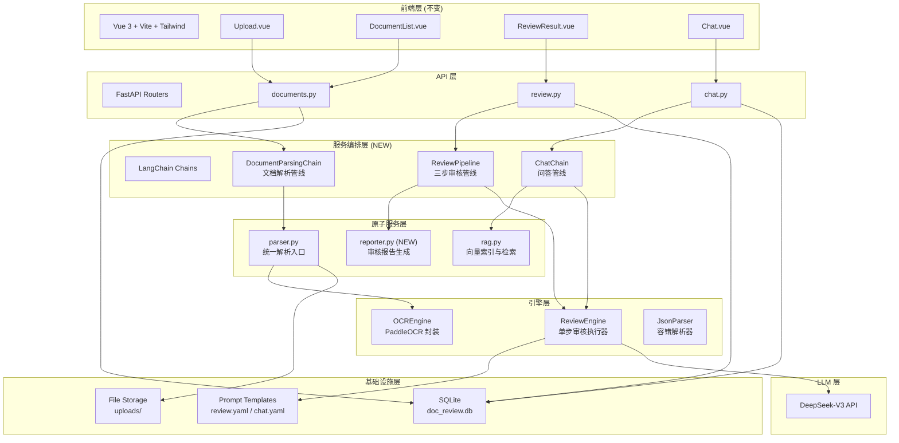

# Day 3：文档审核 v2.0 架构升级

> **学习目标**：将 Day 2 的 v1.0 原型升级为模块化架构，掌握 LangChain 编排审核流程和 PaddleOCR 扫描件处理能力。
>
> **完成标志**：能用 LangChain LCEL 重写审核管线；能集成 PaddleOCR 处理扫描件 PDF；能画出 v2.0 分层架构图并解释模块职责。

---

## 本章阅读约定

本文使用以下四种标记帮助你高效阅读：

| 标记 | 含义 |
|------|------|
| > **提示**： | 帮助理解的补充信息、技巧分享 |
| > **注意**： | 需要特别留意的配置项、易出错的操作 |
| > **避坑**： | 前人踩过的坑，帮你绕开 |
| > **验证**： | 阶段性检查点，确认你做对了 |

文中命令统一使用 **macOS/Linux 终端** 和 **Windows PowerShell** 双标注。`<xxx>` 表示需要替换为你自己的实际内容。

---

## Day 2-4 学习地图

```
Day 2 → "看全貌"
   了解系统架构、SDD 开发、v1.0 原型端到端

Day 3 → "升级架构"  ← 今天
   上午：v1.0 → v2.0 架构设计（诊断痛点 → 设计新架构 → 框架选型）
   下午：LangChain 编排实战 + PaddleOCR 集成实战

Day 4 → "深度优化"
   RAG 多策略检索 + 语义分块 + Human-in-the-Loop
```

> **提示**：今天你会反复做一件事——把 Day 2 写过的功能"拆开重组"。这不是否定 Day 2 的工作，恰恰相反：**好的系统都是重构出来的，不是一口气设计出来的**。Day 2 让你快速看到全貌，Day 3 教你如何把它打磨成工业级产品。

---

## 一、上午：v2.0 架构升级设计

> **上午目标**：诊断 v1.0 的架构缺陷，建立 v2.0 分层架构的全局认知，掌握 LLM 应用框架选型方法论。

### 1. v1.0 回顾与痛点诊断

在 Day 2 结束时，你可能已经隐隐感觉"这代码好像不太对"。今天上午我们把这些感觉变成明确的设计驱动力。

#### 1.1 从"感觉不对"到"明确诊断"

回顾 Day 2 第 6.1 节讨论的三个局限性。现在把它们正名为架构升级的四个驱动力：

| 痛点 | v1.0 表现 | 场景还原 | v2.0 解法 |
|------|----------|---------|-----------|
| **审核流程硬编码** | `reviewer.py` 一个文件包含 Prompt 构建 + API 调用 + JSON 解析 + 结果写入 | 你想加一个"数据合规"维度？改 Prompt 字符串、改 category 枚举、改前端标签——三个地方联动，漏一个就崩 | LangChain Chain 编排，每步独立可替换 |
| **模块边界模糊** | parser / rag / reviewer 职责交叉，`documents.py` 路由直接调用 parser 又直接调 rag | 你想把 TF-IDF 换成 Embedding 检索？得先理清 rag 在哪些地方被调用、调用方式是否一致 | 分层架构：编排层 → 原子服务层 → 引擎层 |
| **不支持扫描件** | PyPDF2 遇到扫描件 PDF 返回空字符串，`parser.py` 无降级策略 | 同事传了一份手机拍的合同照片转成的 PDF，你的系统显示"解析成功，0 个文本块" | PaddleOCR 图像文本提取管线 |
| **Prompt 散落代码** | 审核 Prompt 写死在 `review_document()` 的 f-string 里，问答 Prompt 写在 `chat()` 里 | 法务总监说"我们的审核标准要按公司法务手册改一下"，你说"好，我改代码" | Prompt 模板文件化（YAML），修改后重启即生效 |

#### 1.2 架构升级的本质：从"脚本"到"管线"

```
v1.0 思维：一个函数搞定审核
  输入 text → 拼 Prompt → 调 API → 解析 JSON → 写数据库 → 返回
  问题：改任何一个环节 = 改这个函数 = 牵动全局

v2.0 思维：一条流水线，每个工位各司其职
  文档 → 解析工位 → 拆分工位 → 初审工位 → 合规比对工位 → 报告工位
          ↑          ↑          ↑           ↑            ↑
       parser.py   splitter   reviewer    rule_engine   reporter

  问题：改合规比对逻辑？只改 rule_engine，其他工位不受影响
  问题：加一个工位？在流水线上插一个节点，其他不变
```

> **比喻**：v1.0 = 手工作坊，一个师傅从备料到成品全包。手艺好坏全看师傅当天心情。v2.0 = 流水线工厂，每个工位专做一件事，换人换机器不影响整体。**好的架构不是让每个部分更强，而是让每个部分更独立。**

#### 1.3 你今天要完成的四个升级

```
升级 1：目录结构重构
  v1.0: backend/app/services/{parser,rag,reviewer}.py
  v2.0: backend/app/{services,engines,chains,prompts}/

升级 2：PaddleOCR 集成
  v1.0: parser.py 只处理数字文档
  v2.0: parser.py + ocr.py 自动识别扫描件并提取文本

升级 3：LangChain LCEL 编排
  v1.0: reviewer.review_document() 黑盒调用
  v2.0: review_chain.invoke() 透明管线，三步可见

升级 4：Prompt 模板文件化
  v1.0: f"...请审核以下文档：{text}..." 硬编码
  v2.0: review.yaml + ChatPromptTemplate 加载，改 YAML 不改代码
```

---

### 2. v2.0 系统架构设计

#### 2.1 分层架构全景图

先看全局，再看局部。下面是 v2.0 系统的完整架构：



> **提示**：对比 Day 2 的 v1.0 架构图，最大变化是什么？**多了一层"编排层"和一层"引擎层"**。服务层从"大杂烩"变成了"原子能力"，编排层负责把这些原子能力串起来。这就是分层的本质——**把"组合"和"执行"解耦**。

#### 2.2 逐层职责说明

| 层级 | 职责 | 比喻 | v1.0 对应 | v2.0 变化 |
|------|------|------|----------|-----------|
| **API 层** | 接收 HTTP 请求，参数校验，调用编排层 | 前台接待——收件、登记、转交 | routers/*.py | 不变（兼容） |
| **编排层** | 组合原子服务，定义执行顺序和分支逻辑 | 车间主任——排工序、协调工位 | ❌ 不存在 | ✨ 新增 |
| **原子服务层** | 单一能力封装，不关心调用顺序 | 技术工人——做一件事且做好 | services/*.py | 从"全包"变为"专精" |
| **引擎层** | 底层能力封装（OCR、LLM 调用、JSON 解析） | 工具设备——拿来就用 | ❌ 不存在 | ✨ 新增 |
| **基础设施层** | 配置、数据存储、模板管理 | 仓库和档案室 | config + models | Prompt 模板从代码移到文件 |

#### 2.3 v1.0 → v2.0 代码映射表

这张表帮你快速定位"v1.0 的代码搬去哪儿了"：

| v1.0 文件 | v2.0 去向 | 变化说明 |
|-----------|----------|---------|
| `services/parser.py` | `services/parser.py` | 保留，增加扫描件降级逻辑 |
| `services/rag.py` | `services/rag.py` | 不变 |
| `services/reviewer.py` | `engines/reviewer.py` | 拆分为引擎（执行）+ Chain（编排） |
| ❌ 不存在 | `engines/ocr.py` | 新增 PaddleOCR 封装 |
| ❌ 不存在 | `chains/review_chain.py` | 新增审核编排管线 |
| ❌ 不存在 | `chains/chat_chain.py` | 新增问答编排管线 |
| ❌ 不存在 | `prompts/review.yaml` | 新增审核 Prompt 模板 |
| ❌ 不存在 | `prompts/chat.yaml` | 新增问答 Prompt 模板 |
| ❌ 不存在 | `utils/json_parser.py` | 从 reviewer.py 抽取 JSON 容错逻辑 |
| `routers/review.py` | `routers/review.py` | API 不变，内部调用改为 Chain |
| `routers/documents.py` | `routers/documents.py` | API 不变，内部调用 parser 逻辑不变 |

---

### 3. LLM 应用框架选型评估

v1.0 直接调用 openai SDK，没有用任何 LLM 框架。v2.0 引入编排层后，需要选一个框架来管理 Prompt、串联步骤、处理结构化输出。

#### 3.1 三大框架全景对比

| 框架 | 核心抽象 | 适用场景 | 优势 | 劣势 |
|------|---------|---------|------|------|
| **LangChain** | Chain / LCEL | 线性编排、Prompt 管理 | 生态最丰富、中文资料最多、模板管理成熟、ChromaDB 等工具集成好 | 抽象层偏多，Debug 需要适应期 |
| **LangGraph** | StateGraph（有向图） | 循环/条件分支审核流 | 支持复杂分支逻辑、人工审批节点、错误重试 | 学习曲线陡，v1.0→v2.0 一步跨太大 |
| **LlamaIndex** | Index / QueryEngine | RAG 检索增强 | 检索和索引能力最强，数据连接器丰富 | 编排多步审核流程非其设计初衷 |

#### 3.2 选型结论：LangChain（LCEL 表达式）

理由：

- **LCEL 管道语法直观**：用 `|` 串联步骤，语法接近 v1.0 的函数调用风格。`chain = prompt | llm | parser` 的写法，看一眼就懂
- **Prompt 模板管理**：`ChatPromptTemplate` 天然支持从文件加载模板——这正是解决 Day 2 "Prompt 硬编码"痛点的最优解
- **渐进式引入**：先只用 LCEL 做线性编排，遇到分支/循环场景时再平滑升级到 LangGraph
- **社区资源丰富**：Python 中文社区最活跃的 LLM 框架，学员课后查阅文档和案例的成本最低

> **提示**：选择 LangChain 而非 LangGraph 是一个"留有余地"的决策。Day 3 的审核流是线性的（解析→审核→汇总），不需要图结构。Day 4 引入 Human-in-the-Loop（条件分支：置信度高→直接输出，置信度低→转人工），那时才是 LangGraph 的用武之地。

#### 3.3 LCEL 快速概念预览

在动手之前，先建立对 LCEL 的直观理解：

```python
# v1.0 的审核：一个黑盒函数
def review_document(text: str) -> dict:
    prompt = f"你是一位法务专家，请审核以下文档...{text}"  # 硬编码
    response = client.chat.completions.create(
        model="deepseek-chat",
        messages=[{"role": "user", "content": prompt}]
    )
    return parse_json(response.choices[0].message.content)

# v2.0 LCEL 的审核：一条透明管线
from langchain_core.prompts import ChatPromptTemplate
from langchain_core.output_parsers import JsonOutputParser

prompt = ChatPromptTemplate.from_file("prompts/review.yaml")  # 从文件加载
llm = ChatOpenAI(model="deepseek-chat", base_url="...")       # 模型连接
parser = JsonOutputParser()                                    # 结构化输出

review_chain = prompt | llm | parser   # 管道符串联
result = review_chain.invoke({"text": document_text})  # 传入参数，触发整条链
```

**三个关键概念：**

| 概念 | 说明 | 类比 |
|------|------|------|
| `Runnable` | LCEL 中所有组件的基类，所有组件都是 Runnable | 流水线上的"工位标准接口"——任何工位都能插进去 |
| `\|` 管道符 | 将前一个 Runnable 的输出传给下一个 Runnable | 流水线上的传送带 |
| `invoke()` | 触发整条链的执行 | 按下"启动流水线"按钮 |

> **比喻**：LCEL 的 `|` 管道符就像 Linux 命令行的管道——`cat file.txt | grep "违约" | sort`——每个命令做一件事，数据从左边流到右边。LCEL 在 LLM 调用链上做了同样的事：`prompt | llm | parser`。

---

**上午小结：**

```
上午完成的三件事：
  痛点诊断 → 把 Day 2 结束时四个"感觉不对"变成明确的架构问题
  架构设计 → 五层分层架构（API → 编排 → 服务 → 引擎 → 基础设施）
  框架选型 → LangChain + LCEL，理由充分，为 Day 4 的 LangGraph 留空间

下午要做的事：
  PaddleOCR 集成（40min）→ LangChain 审核编排（80min）→ 架构讨论与 Day 4 预热（30min）
  全程 SDD + Claude Code，每步 Git 存档
```

---

## 二、下午：PaddleOCR 集成与 LangChain 编排实战

> **下午目标**：在 Day 2 的 v1.0 代码基础上，引入 PaddleOCR 处理扫描件，用 LangChain LCEL 重写审核管线，实现 Prompt 模板文件化管理。**全程 Claude Code → 审查 → 验证 → Git 存档。**

### 下午路线图

```
模块四：PaddleOCR 集成（40 分钟）
  ├── 4.1 PaddleOCR 安装与验证
  ├── 4.2 OCREngine 封装
  └── 4.3 改造 parser.py：数字文档 + 扫描件统一入口

模块五：LangChain 审核编排（80 分钟）
  ├── 5.1 项目结构调整（v1.0 → v2.0 目录）
  ├── 5.2 Prompt 模板文件化（review.yaml + chat.yaml）
  ├── 5.3 审核 Chain 编排（三步 LCEL 管线）
  └── 5.4 端到端验证：v2.0 vs v1.0 对比测试

模块六：架构讨论与 Day 4 预热（30 分钟）
  ├── 6.1 v2.0 的局限性（为 Day 4 做铺垫）
  └── 6.2 Day 4 预告与前置准备
```

---

### 4. 模块四：PaddleOCR 集成（扫描件处理能力）

#### 4.1 先理解：为什么需要 OCR？

Day 2 我们用 PyPDF2 和 python-docx 提取文本，这要求文档是"数字原生"的——文本数据直接嵌在文件中。但真实场景中，大量合同是扫描件：

```
数字原生 PDF：
  Word 转 PDF → 文字还是文字，PyPDF2 能直接读

扫描件 PDF：
  纸质合同 → 扫描仪拍照 → PDF 里存的是图片 → PyPDF2 读不出文字
  手机拍合同 → 转成 PDF → 同样只有图片没有文字数据
```

**PaddleOCR 的角色**：把图片里的文字"看"出来，转成计算机能处理的文本。

> **比喻**：PyPDF2 = 从 Word 文档里复制粘贴文字。PaddleOCR = 用手机拍一本书的照片，然后从照片里提取出书上的文字。

#### 4.2 PaddleOCR 安装与配置

**Step 1：安装依赖**

**通用：**
```bash
$ cd backend
$ pip install paddlepaddle   # CPU 版本，实训无需 GPU
$ pip install paddleocr
$ pip install pdf2image       # PDF 转图片工具
$ pip install Pillow           # 图片处理（通常已自带）
```

> **避坑**：PaddlePaddle 安装包较大（约 300MB），建议课前预先安装。如果在 Windows 上遇到 "Microsoft Visual C++ Redistributable is not installed" 错误，去微软官网下载安装 [Visual C++ Redistributable](https://learn.microsoft.com/en-us/cpp/windows/latest-supported-vc-redist)。

**Step 2：验证安装**

**通用：**
```bash
$ python -c "
from paddleocr import PaddleOCR
ocr = PaddleOCR(lang='ch')
print('PaddleOCR 初始化成功')
"
```

首次运行会自动下载中文识别模型（约 15MB），看到 "PaddleOCR 初始化成功" 即安装完成。

> **验证**：
> ```bash
> $ python -c "
> from paddleocr import PaddleOCR
> ocr = PaddleOCR(lang='ch')
> result = ocr.ocr('test_image.png')  # 用一张包含中文的图片测试
> print(result)
> "
> ```
> 如果输出了识别到的文字行及坐标，OCR 功能正常。

> **注意**：`pdf2image` 在 Windows 上依赖 `poppler`。最简单的安装方式——下载 [poppler for Windows](https://github.com/oschwartz10612/poppler-windows/releases/)，解压后将 `bin/` 目录添加到系统 PATH。macOS 用户直接 `brew install poppler`。

#### 4.3 封装 OCREngine

不要让 PaddleOCR 的初始化逻辑散落在代码各处。封装为独立引擎，统一入口。

**Claude Code Prompt：**

```
请帮我在 backend/app/engines/ 目录下创建 ocr.py，封装 PaddleOCR：

1. OCREngine 类：
   - 构造函数中初始化 self.ocr = PaddleOCR(lang='ch')，作为类属性复用
     （不要在每次调用时重新初始化，模型加载很慢）
   - process_image(image_path: str) -> str:
     单张图片 OCR，返回识别出的全部文本（多行用换行符拼接）
   - process_pdf(pdf_path: str) -> str:
     用 pdf2image 将扫描件 PDF 逐页转为 PIL Image
     逐页调用 process_image()，拼接全文档文本
     返回完整文本字符串

2. 错误处理：
   - 图片加载失败 → 抛 ParseError 并注明页码
   - 识别结果为空 → 返回空字符串（不抛异常，可能是空白页）
   - PDF 转换失败 → 抛 ParseError 并给出原因

3. 性能优化：
   - PO 在构造函数中初始化一次，作为实例属性复用
   - 大 PDF（>50 页）打印每页处理进度

4. 更新 backend/requirements.txt，增加：
   paddlepaddle
   paddleocr
   pdf2image
   Pillow
```

审查代码后，验证：

**通用：**
```bash
$ cd backend
$ python -c "
from app.engines.ocr import OCREngine
engine = OCREngine()
# 找一张包含文字的图片测试
text = engine.process_image('test_scan.png')
print(f'识别结果：{text[:200]}...')
print(f'识别字数：{len(text)}')
"
```

> **验证**：输出包含图片中的中文文字，字数 > 0。

#### 4.4 改造 parser.py：数字文档 + 扫描件统一入口

现在 `parser.py` 需要多一个判断逻辑——这份 PDF 是数字文档还是扫描件？

**判断策略**：先用 PyPDF2 尝试提取文本。如果提取结果为空字符串或仅包含空白字符 → 判定为扫描件 → 降级到 OCREngine。

```
parser.py v2.0 逻辑：

输入：文件路径 + 文件类型
  ↓
文件类型判断：
  ├── .txt  → 直接读取文件内容
  ├── .docx → python-docx 提取文本
  └── .pdf  → 进一步判断：
       ├── PyPDF2 提取成功 + 内容非空 → 数字 PDF，返回文本
       └── PyPDF2 提取为空 → 判定为扫描件 → OCREngine.process_pdf()
```

**Claude Code Prompt：**

```
请改造 backend/app/services/parser.py：

1. 在 parse_file() 中增加 PDF 类型判断逻辑：
   - 先用 PyPDF2 尝试提取
   - 如果提取结果为空或仅包含空白字符 → 打印日志"检测到扫描件PDF，降级到OCR处理"
   - 调用 OCREngine().process_pdf() 提取文本
   - 两种路径最终都返回纯文本字符串

2. 保持原有接口不变：
   - parse_file(file_path, file_type) 的签名不变
   - 返回类型不变（纯文本字符串）
   - 对 .docx 和 .txt 的处理逻辑不变

3. 初始化优化：
   - OCREngine 实例在模块级别创建一次（全局单例），不要每次解析都 new
```

审查后验证——需要准备一份扫描件测试 PDF。可以先让 Claude Code 生成一段文字，拍张照转成 PDF，或者用手机将合同页面拍照后转成 PDF。

**通用：**
```bash
$ cd backend
$ python -c "
from app.services.parser import parse_file

# 测试数字 PDF（Day 2 的 test_contract.txt 转成的 PDF）
text = parse_file('test_contract.pdf', 'pdf')
print(f'数字PDF：{len(text)} 字')

# 测试扫描件 PDF
text = parse_file('scanned_contract.pdf', 'pdf')
print(f'扫描件PDF：{len(text)} 字')
"
```

> **验证**：两种 PDF 都能正确提取文本，数字 PDF 和扫描件 PDF 的字数都在合理范围内（扫描件 OCR 可能有少量识别错误，不影响后续审核）。

✅ **Git 存档点 9**：

**通用：**
```bash
$ git add . && git commit -m "v2.0 PaddleOCR集成：OCREngine封装 + parser扫描件降级"
```

---

### 5. 模块五：LangChain 审核编排

这是 Day 3 最核心的模块。你会把 Day 2 的 `reviewer.py`（单一文件 300 行）拆成三层：**Prompt 模板文件 + 引擎执行器 + Chain 编排管线**。

#### 5.1 安装 LangChain 与调整项目结构

**Step 1：安装**

**通用：**
```bash
$ cd backend
$ pip install langchain langchain-core langchain-openai
```

**Step 2：创建 v2.0 目录结构**

先让 Claude Code 在 Plan Mode 下生成改造方案，确认后再执行。

**Claude Code Prompt（Plan Mode）：**

```
请基于当前 backend/ 代码，设计 v1.0 → v2.0 的目录结构升级方案：

需要新增的目录和文件：
- backend/app/engines/         # 引擎层（ocr.py 已有 + reviewer.py 迁入）
- backend/app/chains/           # 编排层（review_chain.py + chat_chain.py）
- backend/app/prompts/          # Prompt 模板（review.yaml + chat.yaml）
- backend/app/utils/            # 工具函数（json_parser.py 从 reviewer.py 抽取）

需要改造的文件：
- backend/app/services/reviewer.py → 迁移到 engines/reviewer.py + 逻辑拆分
- backend/app/routers/review.py → API 不变，内部调用改为 Chain
- backend/app/main.py → 如有需要，更新 import 路径

请先列出改造计划，不要直接操作文件。
```

审查方案后，退出 Plan Mode，在 Normal Mode 中执行。

**Claude Code Prompt（Normal Mode）：**

```
请按刚才确认的方案，帮我完成目录结构调整：

1. 创建新目录：engines/、chains/、prompts/、utils/
2. 将 reviewer.py 的 JSON 容错解析逻辑抽取到 utils/json_parser.py
3. 更新 routers/ 中的 import 路径（如有变化）
4. 确保所有现有 API 端点不变，Swagger 正常

注意：先创建新文件，验证无误后再删除旧代码。不要一次性全部移动。
```

✅ **Git 存档点 10**：

**通用：**
```bash
$ git add . && git commit -m "v2.0 目录分层：engines/chains/prompts/utils 四层架构"
```

#### 5.2 Prompt 模板文件化

这是今天下午最具工程价值的环节。Day 2 的审核 Prompt 长这样：

```python
# v1.0 —— Prompt 散落在代码中
prompt = f"""你是一位资深法务合同审核专家。
请从以下四个维度审核这份合同：
1. 合规风险：违反法律法规、行业标准
2. 条款缺失：缺少保密/违约责任/争议解决等保护性条款
3. 表述模糊：含义不清晰、容易歧义
4. 权益不对等：权利义务明显不对等

请返回 JSON 格式...
合同内容：{text}"""
```

问题很明显：**审核维度改了 → 改代码 → 重启服务 → 可能改出语法错误**。法务人员根本不敢改。

v2.0 的解：**把 Prompt 从代码中抽离到 YAML 文件，运维同学都能改。**

**Step 1：创建审核 Prompt 模板**

让 Claude Code 帮你生成：

**Claude Code Prompt：**

```
请帮我创建 backend/app/prompts/review.yaml：

这个 YAML 文件定义文档审核的 Prompt 模板，结构如下：

system: |
  你是一位资深法务合同审核专家，拥有15年合同审查经验。
  请按照以下维度对合同进行专业审核，每个发现的风险项都要引用原文并给出修改建议。

human: |
  请审核以下合同内容：
  {document_text}
  
  对每个风险项，请提供：
  - category: 所属审核维度
  - severity: high / medium / low
  - title: 风险简述
  - description: 详细风险分析
  - source_text: 原文引用（10-50字）
  - suggestion: 具体修改建议
  
  返回格式必须是合法JSON，不要包含markdown代码块标记：
  {{
    "summary": "审核总结（1-2句话，概述合同整体风险水平）",
    "items": [
      {{
        "category": "合规风险|条款缺失|表述模糊|权益不对等|数据合规",
        "severity": "high|medium|low",
        "title": "...",
        "description": "...",
        "source_text": "...",
        "suggestion": "..."
      }}
    ]
  }}

dimensions:
  - name: 合规风险
    key: compliance
    description: >
      审查合同条款是否违反现行法律法规、行业监管规定。
      关注：行政许可要求、税务合规、劳动法合规、反垄断条款等。
  - name: 条款缺失
    key: incompleteness
    description: >
      检查合同是否缺少必要的保护性条款。
      必备条款：保密条款、违约责任条款、争议解决条款、知识产权归属、不可抗力条款。
  - name: 表述模糊
    key: ambiguity
    description: >
      检查合同中的模糊表述和歧义用语。
      常见问题："合理期限""适当补偿""根据实际情况"等无量化标准的表述。
  - name: 权益不对等
    key: imbalance
    description: >
      审查合同双方权利义务是否明显不对等。
      关注：单方解约权、过高的违约金、免责条款过于宽泛、责任上限过低。
  - name: 数据合规
    key: data_compliance
    description: >
      审查合同是否涉及个人信息收集与处理，是否符合《个人信息保护法》要求。
      关注：数据收集范围、使用目的、第三方共享、用户权利保障、跨境数据传输。
```

**Step 2：创建问答 Prompt 模板**

**Claude Code Prompt：**

```
请帮我创建 backend/app/prompts/chat.yaml：

system: |
  你是一位专业法务助手，基于给定的合同文档内容回答用户问题。
  你的回答应：
  - 准确基于文档内容，不编造不存在的信息
  - 引用原文关键句作为依据
  - 用清晰的中文表达，分点回答复杂问题
  - 如果文档中没有相关信息，诚实说明"文档中未涉及此内容"

human: |
  以下是与用户问题相关的文档片段：
  {context}
  
  最近对话历史：
  {history}
  
  用户问题：{question}
  
  请基于以上文档内容回答。
```

**Step 3：让代码加载 Prompt 模板**

**Claude Code Prompt：**

```
请帮我改造 backend/app/engines/reviewer.py（从 services/reviewer.py 迁移并重构）：

1. ReviewEngine 类：
   - 构造函数中加载 prompts/review.yaml 为 ChatPromptTemplate
   - review(text: str) 方法：
     * 将 dimensions 列表格式化为 Prompt 中的维度描述
     * 调用 self.chain.invoke({"document_text": text})
     * 返回解析后的 dict（含 summary 和 items）

2. ChatEngine 类：
   - 构造函数中加载 prompts/chat.yaml
   - chat(context: str, history: str, question: str) 方法：
     * 传入 {context, history, question}
     * 返回 AI 回复文本

3. JSON 解析逻辑移到 utils/json_parser.py：
   - extract_json(text: str) -> dict：
     * 先尝试 json.loads(text)
     * 失败则用 re.findall(r'\{[\s\S]*\}', text) 提取
     * 两次都失败则抛 ParseError，并记录原始响应
```

> **验证**：修改 `review.yaml` 中 dimensions 下的某个维度描述，重启后端，重新审核同一份文档——审核结果应反映新的维度描述。

✅ **Git 存档点 11**：

**通用：**
```bash
$ git add . && git commit -m "v2.0 Prompt模板文件化：review.yaml + chat.yaml + ReviewEngine重构"
```

#### 5.3 审核 Chain 编排（LCEL 管线）

现在把"审一份合同"这件事拆成三步流水线：

```
Step 1：文档结构分析
  输入：合同全文
  输出：章节结构 + 关键条款位置
  目的：给后续审核提供"地图"

Step 2：逐维度并行审核
  输入：合同全文 + 结构分析结果 + 5 个审核维度
  输出：每个维度的风险项列表
  目的：各维度独立审核，互不干扰，并行加速

Step 3：审核报告汇总
  输入：5 个维度的风险项
  输出：去重排序后的最终审核结果 + summary
  目的：同一风险被多维度标记时合并，按严重程度排序
```

**为什么要三步而不是一步？**

Day 2 的一步审核：`review_document(text)` → 一次 API 调用，所有维度的结果都在一次返回里。

问题：LLM 在单次调用中要同时做"理解文档结构"+"按多维度审核"+"写总结"，就像让你同时做数学题、写作文、画流程图——每一样都做得不够好。

拆成三步：每步各让 LLM 聚焦一件事。结构分析更准，维度审核更细，报告汇总更合理。

> **比喻**：一步审核 = 叫一个人同时洗菜、切菜、炒菜、摆盘。三步审核 = 流水线上四个厨师各自专做一件事。后者品质更稳定。

**Claude Code Prompt：**

```
请帮我创建 backend/app/chains/review_chain.py，实现三步 LCEL 审核管线：

1. Step 1 - 文档结构分析 Chain（structure_chain）：
   - 创建 ChatPromptTemplate，Prompt 要求：
     "分析以下合同文档，提取：
      - 章节标题和行号范围
      - 关键条款位置（价格、交付、验收、违约、保密等）
      返回 JSON：{ sections: [{title, start, end}], key_clauses: [{type, location}] }"
   - chain = structure_prompt | llm | JsonOutputParser()

2. Step 2 - 并行维度审核（dimension_review_chain）：
   - 从 review.yaml 读取 dimensions 列表
   - 为每个维度创建独立的审核 Prompt（只审这一个维度）
   - 使用 RunnableParallel 并行调用：
     dim_reviews = {
       dim["key"]: single_dim_chain
       for dim in dimensions
     }
   - 返回：{ "compliance": [...], "incompleteness": [...], ... }

3. Step 3 - 报告汇总 Chain（summary_chain）：
   - Prompt 要求：
     "汇总以下各维度的审核结果：
      - 去重：同一原文片段被多维度标记 → 合并为一条，category 取首个维度
      - 排序：按 severity 降序（high → medium → low）
      - 生成 summary：含总风险数、各等级分布、最需关注的 TOP 3 问题
      返回 JSON"
   - chain = summary_prompt | llm | JsonOutputParser()

4. 主 Chain（review_pipeline）：
   使用 RunnableLambda 串联三步：
   def _run_step1(inputs):
       structure = structure_chain.invoke({"document_text": inputs["text"]})
       inputs["structure"] = structure
       return inputs
   
   def _run_step2(inputs):
       dim_result = dimension_review_chain.invoke({
           "document_text": inputs["text"],
           "structure": inputs["structure"]
       })
       inputs["dim_results"] = dim_result
       return inputs
   
   def _run_step3(inputs):
       return summary_chain.invoke({
           "dim_results": inputs["dim_results"],
           "document_text": inputs["text"]
       })
   
   pipeline = (
       RunnableLambda(_run_step1)
       | RunnableLambda(_run_step2)
       | RunnableLambda(_run_step3)
   )

5. 更新 backend/app/routers/review.py：
   - 从 chains/review_chain.py 导入 review_pipeline
   - 将原来的 reviewer.review_document() 替换为 pipeline.invoke({"text": full_text})
   - API 接口签名和返回值格式不变
```

> **提示**：如果你发现 `RunnableParallel` 的并行审核效果不明显——原因是 DeepSeek API 本身有并发限制。此时可以先串行调用来验证逻辑正确性，Day 4 再做真正的异步并发优化。

**审查要点：**
- [ ] Step 1 的结构分析结果是否返回了合理的章节结构？
- [ ] Step 2 每个维度的审核结果是否独立（不会重复出现同一风险）？
- [ ] Step 3 的汇总是否真的做到去重和排序？
- [ ] router 中的调用是否从旧函数变为 pipeline.invoke()？

**验证端到端：**

**通用：**
```bash
# 终端 1：启动后端
$ cd backend && uvicorn app.main:app --reload

# 终端 2：用 curl 测试
$ curl -X POST http://localhost:8000/api/documents/1/review
```

打开 Swagger http://localhost:8000/docs，确认 `/api/documents/{id}/review` 仍然可用，且返回的审核结果格式不变。

✅ **Git 存档点 12**：

**通用：**
```bash
$ git add . && git commit -m "v2.0 LCEL审核管线：三步编排 + RunnableParallel并行维度审核"
```

#### 5.4 端到端验证：v2.0 vs v1.0 对比测试

现在做一个有意义的对比——同一份合同，v1.0 和 v2.0 分别审核，看差异。

**如果保留了 v1.0 分支**（推荐——通过 git branch 切换）：

| 对比维度 | v1.0 预期 | v2.0 预期 | 你的实测 |
|---------|----------|----------|---------|
| 审核耗时 | 20-30 秒（串行） | 15-25 秒（并行） |  |
| 审核结果结构 | 一次返回所有 | Step 1/2/3 各有日志 |  |
| 新增维度操作 | 改 reviewer.py 代码 | 改 review.yaml |  |
| 扫描件 PDF | 解析失败 | 正常识别并审核 |  |
| 各维度结果独立性 | 混合在一条 JSON 中 | 各自独立可追溯 |  |

**新增维度计时测试（推荐每个人做一次）：**

```
任务：在五个维度基础上增加"知识产权合规"维度

v1.0 方式（回顾 Day 2 实验）：
  1. 找到 reviewer.py 中的审核 Prompt 字符串
  2. 在四个维度后加第五个
  3. 修改 category 可选值列表
  4. 修改前端 ReviewResult.vue 的分类标签映射
  预计耗时：5-8 分钟（含重启）

v2.0 方式：
  1. 打开 prompts/review.yaml
  2. 在 dimensions 列表末尾加一项
  3. 重启后端
  预计耗时：1-2 分钟（含重启）
```

> **验证**：如果你在 2 分钟内完成了新增维度的全部操作并看到审核结果——你已经亲身体验到了 v2.0 架构升级的核心价值。

---

### 6. 模块六：架构讨论与 Day 4 预热

#### 6.1 v2.0 的局限性——为明天铺路

经过了今天的架构升级，v2.0 已经比 v1.0 强很多。但它仍然有天花板：

**问题 1：LangChain 的"黑盒感"**

```
现状：LCEL 表达式简洁，但出错时 trace 日志像天书
      step1 | step2 | step3 → step2 报错，哪个参数传错了？很难一眼看出来
Day 4 解法：LangSmith 追踪（如果你有账号）或自定义回调函数，打印每一步的输入输出
```

**问题 2：审核维度仍然是固定列表**

```
现状：review.yaml 中 dimensions 是静态列表
      "见合同就审这 5 个维度"
痛点：采购合同应该侧重"验收标准"和"违约责任"
      保密协议应该侧重"保密范围"和"违约赔偿"
      不同文档类型有不同的审核重点
Day 4 解法：审核规则引擎——根据文档类型动态激活/跳过维度
```

**问题 3：TF-IDF 检索天花板**

```
现状："违约责任"搜不到"违约金条款"
      "知识产权"搜不到"专利归属"
      用户用自然语言提问时关键词匹配不准
Day 4 解法：语义分块 + embedding 向量检索 + 混合检索（关键词 + 语义 + Rerank）
```

**问题 4：审核结果"一次性"，错了没法纠正**

```
现状：LLM 输出审核结果 → 直接展示给用户
      漏判了（没发现真正的风险）→ 用户不知道
      误判了（把正常条款标为风险）→ 用户只能手动忽略
Day 4 解法：Human-in-the-Loop → AI 初筛 → 置信度评估 → 低置信度转人工复核
```

> **提示**：跟 Day 2 结束时一样——能说出"哪里不够好"比能说出"哪里好"重要得多。你刚才发现的每一个问题，都是 Day 4 的升级方向。

#### 6.2 Day 4 预告与前置准备

**Day 4 上午：RAG 深度优化**

- 语义分块：按语义边界切分，而非固定 500 字
- 层级分块：文档→章节→段落→句子，多粒度索引
- 混合检索：TF-IDF + Embedding + Rerank 三阶段检索
- 自定义规则库：企业法规/行业标准的向量化检索

**Day 4 下午：Human-in-the-Loop + 本地部署**

- HITL 审核闭环：AI 初筛 → 置信度打分 → 低置信度转人工复审 → 标注结果回流训练
- Ollama + Qwen 3 7B 本地部署体验
- Day 2-4 三天系统演进全景回顾

**今晚可以提前了解：**

1. 浏览 LangChain RAG 文档：https://python.langchain.com/docs/how_to/#qa-with-rag
2. 思考一个问题：你手上的 v2.0 系统，哪一步最需要"人的判断"介入？为什么？
3. 下载 Ollama：https://ollama.com，为 Day 4 的本地部署做准备

---

## 三、晚间作业

> **注意**：晚间作业要求全程使用 Claude Code + Git 存档。每完成一个作业步骤就 `git commit` 一次，最终在 Day 2 基础上至少新增 4 个 commit。

1. **完成 v2.0 全部升级**：在 Day 2 项目基础上完成 PaddleOCR 集成 + LangChain 编排 + Prompt 模板文件化。验证标准：项目目录下能看到 `engines/`、`chains/`、`prompts/` 三个新目录，所有 API 端点仍正常运行。

2. **对比实验报告**（不少于 500 字）：
   - 同一份合同，v1.0 和 v2.0 的审核耗时对比（各测 3 次取平均）
   - 新增一个审核维度（如"税务合规"或"知识产权合规"），记录 v1.0（改代码）和 v2.0（改 YAML）的操作耗时，对比哪个更快、更安全
   - 用一份扫描件 PDF 测试 OCR 识别效果（目测即可，挑 3 处识别错误的案例并分析原因）
   - 你认为 LCEL 编排 vs 原始函数调用，哪个更容易维护？为什么？结合今天的实际操作来写

3. **架构图绘制**：用 Mermaid 或手绘，画出 v2.0 审核管线从"用户点击审核"到"返回结果"的完整数据流图，标注每一步的输入输出。

4. **Preview Day 4**（选做）：阅读 LangChain 文档中关于 RAG 的部分，写出至少 3 个你认为可以优化当前 TF-IDF 检索的方向。

---

## 四、验证清单

完成以下所有项，今天的实训才算合格：

### 上午验证

- [ ] 能说出 v1.0 至少 3 个架构缺陷及其 v2.0 解法
- [ ] 能画出 v2.0 五层分层架构图，解释每层的职责
- [ ] 能对比 LangChain / LangGraph / LlamaIndex 各自的适用场景
- [ ] 能解释 LCEL `|` 管道符的工作原理和数据流转方式

### 下午验证

- [ ] PaddleOCR 已安装且 `PaddleOCR(lang='ch')` 初始化成功
- [ ] `engines/ocr.py` 中 OCREngine 封装完成，`process_pdf()` 可正常输出文本
- [ ] `parser.py` 改造完成，扫描件 PDF 上传后能自动降级到 OCR 并成功解析
- [ ] 项目目录下存在 `prompts/review.yaml` 和 `prompts/chat.yaml`
- [ ] 修改 YAML 中的审核维度，无需改 Python 代码即可生效
- [ ] `chains/review_chain.py` 中实现了三步 LCEL 管线
- [ ] Step 1（结构分析）、Step 2（维度审核）、Step 3（报告汇总）各有清晰日志
- [ ] Swagger 中所有 API 端点与 Day 2 保持一致（前端兼容）
- [ ] Git 提交在 Day 2 基础上新增至少 4 个 commit

### 端到端功能验证

- [ ] 上传数字 PDF → 审核 → 审核结果正常返回
- [ ] 上传扫描件 PDF → OCR 提取 → 审核 → 审核结果正常返回（可能有 OCR 噪声，但应有内容）
- [ ] 问答功能不受影响（基于文档内容回答）
- [ ] 新增维度后重新审核，结果中出现了新维度的风险项

### 常见问题排查

| 问题 | 原因 | 解决方案 |
|------|------|---------|
| PaddleOCR 初始化报 `ModuleNotFoundError` | 未安装或版本不兼容 | `pip install paddlepaddle paddleocr --upgrade` |
| `pdf2image` 报 `PDFInfoNotInstalledError` | 缺少 poppler | Windows 下载 poppler 并配置 PATH；macOS `brew install poppler` |
| LCEL 管道 `|` 语法报 `TypeError` | LangChain 版本 < 0.2 | `pip install langchain-core>=0.2` |
| 扫描件识别结果乱码 | 图片分辨率太低或倾斜严重 | 预处理：提高 DPI（≥300）+ 二值化 + 去噪 |
| `RunnableParallel` 执行后结果顺序混乱 | LCEL 并行不保证输出顺序 | 不用依赖输出顺序，或串行执行 |
| 并行审核后结果比 v1.0 差 | 各维度 LLM 调用缺全局上下文 | 确保 Step 1 的结构分析结果传入了 Step 2 |
| 改造后 `ImportError` | 模块移动后 import 路径未更新 | 用 Claude Code 全局搜索旧路径并批量替换 |
| YAML 修改后审核结果不变 | 后端未重启，缓存的旧模板未刷新 | 确认 uvicorn --reload 已触发重载，或手动重启 |

---

> **Day 3 完成！** 你今天上午做了架构升级设计，下午用 LangChain LCEL 重写了审核管线、集成了 PaddleOCR 处理扫描件、把 Prompt 从代码中抽离到 YAML 文件——v1.0 的"小作坊"变成了 v2.0 的"流水线"。你新写的 `chains/review_chain.py` 和 `prompts/review.yaml` 就是今天最好的学习成果。明天 Day 4，我们将在 v2.0 的基础上做最后一步优化——把 RAG 从"关键词匹配"升级为"语义理解"，并引入 Human-in-the-Loop 人机协同审核。今晚的作业就是巩固今天的升级成果。
