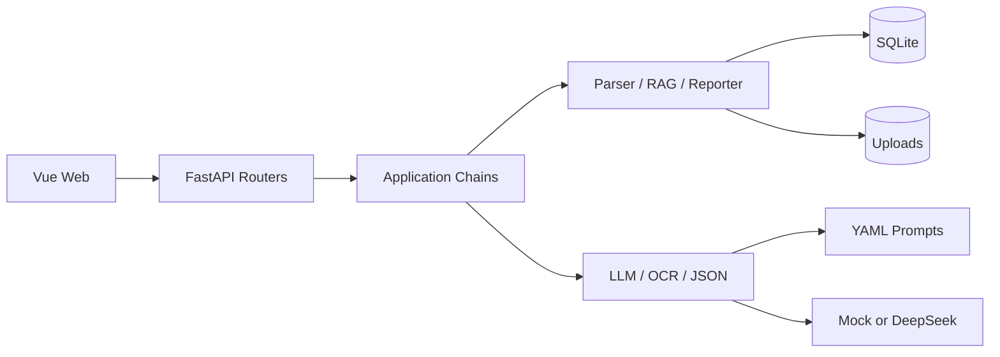

# RAG 文档审核系统技术规范

## 1. 目标与范围

本项目按两个可回退里程碑交付：Day2 v1.0 完成轻量 RAG 文档审核原型；Day3 v2.0 在保持 9 个 HTTP 端点与前端路由兼容的前提下，引入 OCR、Prompt 文件化和 LangChain LCEL 编排。

范围内：PDF/DOCX/TXT 上传、文档管理、四维或配置化多维审核、基于当前文档的问答、SQLite 持久化、Vue 深色界面、Mock 端到端验证。

范围外：登录权限、报告导出、批量对比、Day4 Embedding/混合检索、LangGraph/HITL、本地模型和生产部署。

## 2. 技术栈

- Python 3.11、FastAPI、SQLAlchemy 2、Pydantic 2、SQLite。
- PyPDF2、python-docx、scikit-learn TF-IDF；Day3 可选 PaddleOCR 3.7。
- Day2 使用 OpenAI-compatible client；Day3 使用 langchain-core 与可注入 ChatModel。
- Vue 3、Vite、TypeScript、Vue Router、Axios、Tailwind CSS、markdown-it。
- pytest、Vitest、Playwright；CodeGraph 用于结构查询和影响分析。

## 3. 系统架构

Day2 先以 service 组合完成同一行为；Day3 将组合职责迁入 DocumentParsingChain、ReviewPipeline 和 ChatChain，原子服务与引擎不负责业务顺序。

## 4. 数据模型

系统保持五张业务表：

- Document：文件元数据、安全存储路径、状态、审核状态、正文、摘要、chunk 数、解析方式、错误信息和上传时间。
- Review：document_id、状态、summary、总问题数、高风险数、耗时、管线版本、Prompt 版本、错误信息和审核时间。
- ReviewItem：review_id、category、severity、title、description、suggestion、source_text。
- ChatSession：document_id、created_at。
- ChatMessage：session_id、role、content、created_at。

关系均使用 ORM cascade 与 SQLite 外键：Document 1:N Review、Review 1:N ReviewItem、Document 1:N ChatSession、ChatSession 1:N ChatMessage。

## 5. 状态机

- 文档：uploaded -> parsing -> ready；失败进入 parse_failed。
- 审核：pending -> reviewing -> completed；失败进入 review_failed。
- 解析失败必须保留 Document 记录和错误原因；审核失败必须保留 Review 记录并恢复可重试状态。

## 6. HTTP 契约

| 方法 | 路径 | 说明 |
|---|---|---|
| POST | /api/documents/upload | multipart 字段 file；返回文档与 chunk_count |
| GET | /api/documents | 返回 `{items, total}`，上传时间降序 |
| GET | /api/documents/{doc_id} | 文档详情 |
| DELETE | /api/documents/{doc_id} | 删除文件和全部关联数据 |
| POST | /api/documents/{doc_id}/review | 新建一次审核 |
| GET | /api/documents/{doc_id}/review | 最新审核结果 |
| POST | /api/documents/{doc_id}/chat | `{question, session_id?}` |
| GET | /api/documents/{doc_id}/chat/history | 可选 session_id 查询参数 |
| GET | /api/health | 服务与 provider 模式 |

统一错误体为 `{code, message, detail?}`。不存在返回 404，状态冲突返回 409，输入无效返回 422。ReviewItem 的 category 为字符串并由 Prompt 配置校验，不使用固定数据库枚举。

## 7. 解析与 RAG

- 文件名只用于展示；磁盘名使用随机安全标识，禁止路径穿越和覆盖。
- 上传时先落库，再保存、解析和建索引。删除同时清理磁盘文件。
- RAG 按 document_id 隔离，正文持久化；内存索引缺失时惰性重建。
- chunk_size=500、overlap=100，TfidfVectorizer 使用 char_wb，默认 top_k=5。
- Day3 对 PDF 逐页判断：数字页用 PyPDF2，空白页走 OCR，最终按原页序合并。

## 8. 审核与问答

- v1.0：一次审核调用处理四个维度；输出必须通过 Pydantic ReviewResult 校验。
- v2.0：结构分析 -> 各维度并行审核 -> 汇总；Reporter 负责确定性去重、等级排序和计数。
- 默认 Mock provider 产生稳定结果；所有报告以 PASS (Mock) 标识外部能力。
- 每次重新审核新建 Review；最新结果端点不删除历史记录。
- Chat 未传 session_id 时复用该文档最新会话或创建新会话；上下文取最近四轮。

## 9. 前端规范

- `/` 重定向 `/documents`；其余路由为 `/upload`、`/documents`、`/documents/:id/review`、`/documents/:id/chat`。
- 桌面端 240px 固定侧栏，移动端改为顶部导航；主题色遵循 PRD。
- 交互控件最小 44px，键盘可用、焦点可见、状态不只靠颜色表达，并支持 reduced-motion。
- Markdown 禁用原始 HTML；删除必须二次确认，异步操作提供加载、错误和重试反馈。

## 10. 验收策略

- 后端：pytest 覆盖五表、状态机、三格式解析、索引隔离与重建、级联删除、重复审核、会话历史和 9 端点。
- 前端：类型检查、Vitest、生产构建与 Playwright 主流程。
- v2：OCR adapter、三阶段 schema、维度绑定、去重排序、Prompt 变更和 OpenAPI 兼容。
- 每个小步骤测试通过后单独提交；Day2、Day3 分别保留分支和标签。

