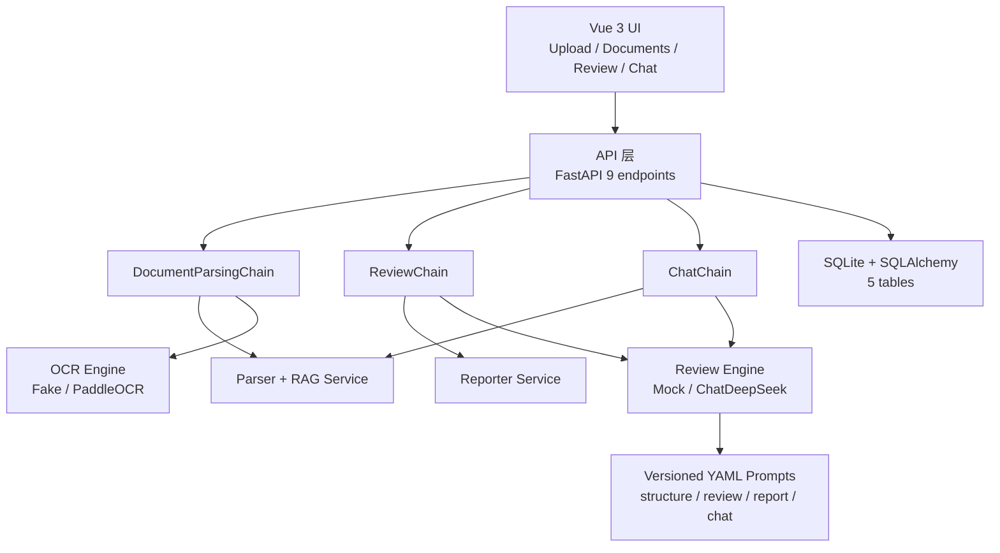
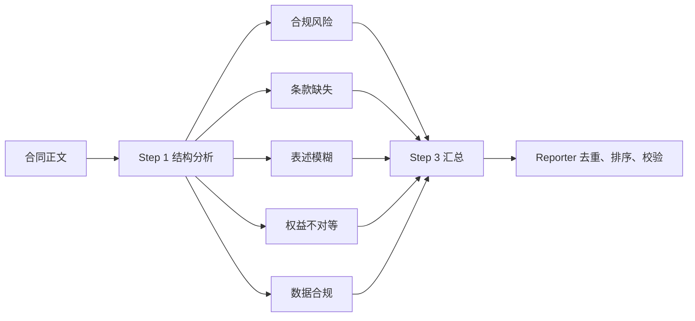

# Day3 v2.0 架构说明

## 设计结论

v2.0 在不改变 Day2 九个 HTTP 端点的前提下，将原先集中在路由和 `reviewer.py` 的流程拆为五层。升级重点不是增加更多类，而是让“组合流程”与“执行能力”分离：API 只处理协议和持久化状态，Chain 负责步骤顺序，Service 提供确定性业务能力，Engine 封装外部运行时，Prompt/配置负责可变规则。

## 三阶段审核管线

Step 1 只理解主体、标的、期限和章节；Step 2 使用 `RunnableParallel` 按 YAML 中的维度动态建立节点，并把最大并发限制为 2；Step 3 汇总结果，随后由确定性的 Reporter 做引文归一、重复项合并和风险等级排序。Mock 与 DeepSeek 共享相同边界，外部模型输出还要经过 JSON 提取和 Pydantic 字段校验。

## OCR 与解析策略

数字 PDF 先由 PyPDF2 提取文字。只有结果为空或全为空白时才调用 OCR Provider，避免对可复制 PDF 产生额外耗时和识别误差。默认 `OCR_PROVIDER=fake` 用于契约测试，状态记录为 `ocr-mock`；生产可安装 `requirements-ocr.txt` 并配置 `OCR_PROVIDER=paddle`。PaddleOCR 在第一次真实调用时才惰性加载，测试和普通数字 PDF 不承担大模型初始化成本。

## 配置和可观测性

`review.yaml` 是审核维度的单一来源。实验提交 `caab175` 仅增加一段 YAML，就让管线从五维扩展到六维；提交 `afd30d7` 恢复产品默认五维，证明无需修改 Python 或 Vue。运行日志只记录阶段、耗时、维度数和问题数，不记录合同全文、聊天内容或密钥。JSON 失败日志使用响应长度和 SHA-256 短摘要定位，避免把模型原文写入日志。

## 兼容性边界

OpenAPI 自动测试锁定 Day2 的九个 method/path 组合，上传、审核和问答响应主字段保持不变。新增信息复用已有 `pipeline_version`、`prompt_version` 和 `parse_method` 字段，前端无需修改即可显示 v2.0 管线。真实 DeepSeek 与真实 PaddleOCR 因没有生产凭据和重型运行时未执行质量测试，其状态为 `PASS (Mock)`，不能解读为生产质量结论。
