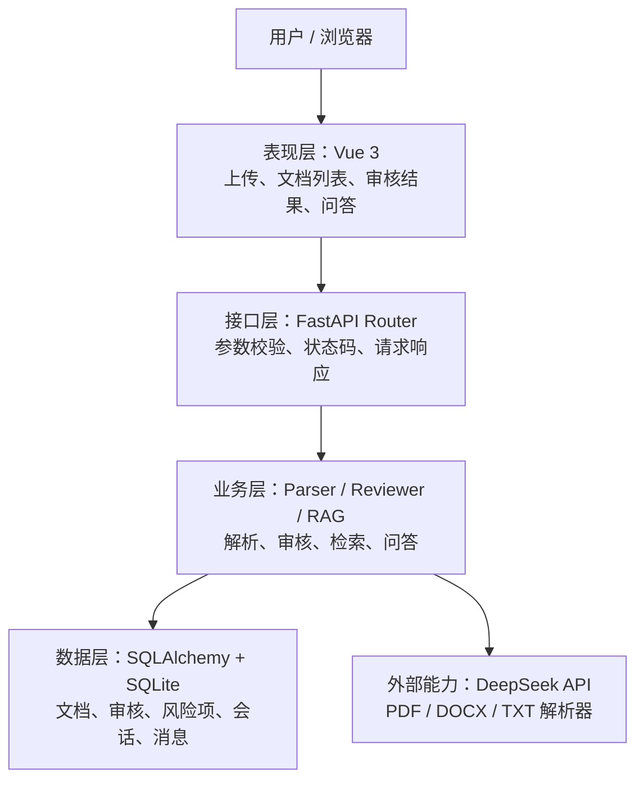
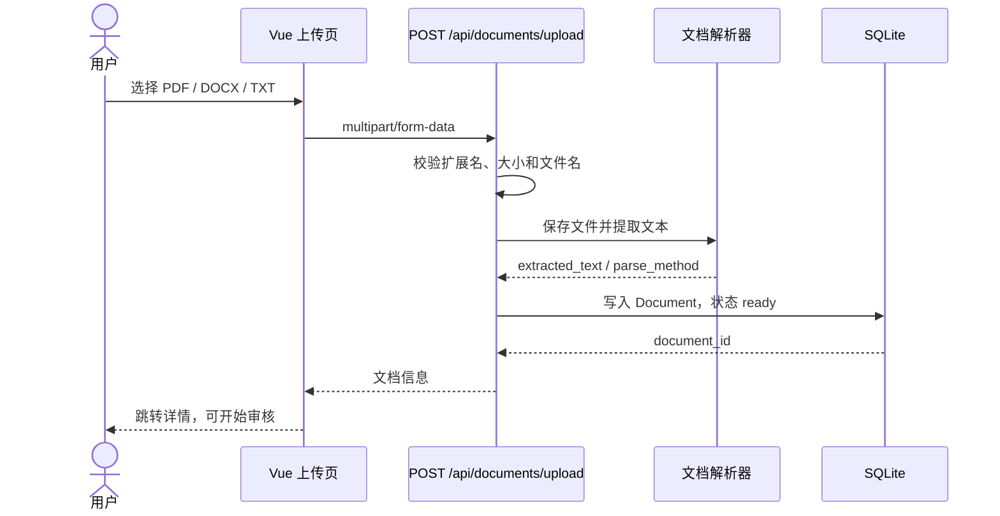
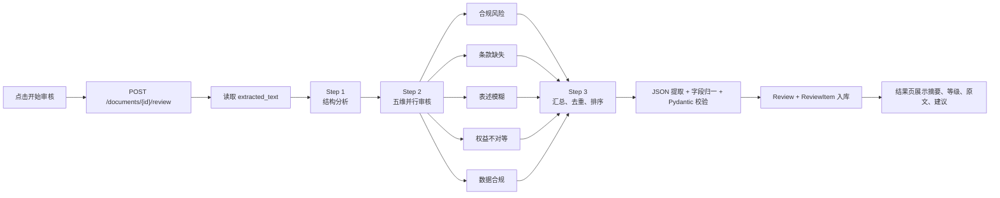

# 答辩准备：第 3、4、5 项

本文用于答辩前快速复习。建议现场先画架构，再沿箭头讲数据流，最后用真实踩坑和 Git 记录证明实现过程。

## 3. 架构图与两条核心数据流

高清图片：[architecture-defense.png](assets/architecture-defense.png)

### v1.0 分层架构



手绘口诀：**用户 → Vue → FastAPI → 业务服务 → 数据库/外部能力**。每层只讲一个职责：页面负责交互，Router 负责协议，业务层负责流程，数据层负责持久化，外部能力负责模型和文件解析。

### 上传链路



一句话讲解：上传链路把“二进制文件”变成“可审核文本”，同时保存文件元数据、解析方式和状态；只有状态为 `ready` 的文档才能进入审核。

### 审核链路（当前 v2.0 实现）



一句话讲解：审核链路把“合同全文”变成“结构化风险项”；v2.0 将一次大 Prompt 拆成结构分析、维度审核、报告汇总三阶段，并在入库前做确定性校验。

### v1.0 与 v2.0 的答辩连接句

v1.0 的优点是调用链短、容易跑通，缺点是 Prompt、流程和模型调用耦合在一起。v2.0 保持 API 不变，把组合流程交给 Chain，把模型调用交给 Engine，把可变规则放进 YAML，因此新增维度和定位故障都更容易。

## 4. 真实踩坑故事

### 标题：DeepSeek 返回了 JSON，但不是系统期待的 JSON

**背景**：Mock 环境一直正常，切换到真实 DeepSeek 并上传 DOCX 后，先后出现“包含未知分类”和“维度审核结果字段不完整”。这类问题最难排查，因为网络请求成功、模型也返回了 JSON，错误发生在结果进入数据库之前。

**我最初的判断**：怀疑 DOCX 解析失败。但查看错误边界后发现，文档已经成功提取文本，真正失败点是 Pydantic 对模型返回值做结构校验。模型会把 `category` 写成“知识产权风险”，也会把标准字段写成 `risk_level`、`analysis`、`quote`、`recommendation`，甚至省略 `source_text`。

**解决过程**：

1. 先缩小故障范围：区分文件解析、DeepSeek 请求、JSON 提取和字段校验四个阶段。
2. 收紧 Prompt：明确分类只能来自 YAML 五维，六个字段不得改名或省略。
3. 增加防御性归一层：兼容常见容器和字段别名，将中文风险等级转换为 `high/medium/low`。
4. 保留严格边界：归一后仍由 Pydantic 校验；缺少原文时明确标记“需人工复核”，绝不伪造合同证据。
5. 增加回归测试，覆盖未知分类、字段别名、中文等级和缺少原文四类情况。

**结果**：真实模型的非确定性被限制在 Engine 边界内，Router、数据库和前端继续只接收稳定结构。相关提交为 `936a44f` 和 `23cdaba`，后端回归测试达到 33 项全部通过。

**答辩时 40 秒版本**：

> 最大的坑不是 API 连不上，而是 API 成功返回了“看起来正确”的 JSON。Mock 会严格按 schema 输出，真实 DeepSeek 却可能创造分类、改字段名或漏字段。我先根据报错把问题定位到 Pydantic 校验边界，然后采用“Prompt 约束 + 字段归一 + 严格校验 + 回归测试”四层防线。对于缺失原文的结果只标记人工复核，不伪造证据。这个问题让我认识到，接入大模型不能把它当普通函数，必须把不确定性封装在明确边界里。

## 5. Git log 证据

截图文件：[git-log-day3.png](assets/git-log-day3.png)

当前 Day3 后续记录包含 14 条连续、有意义的提交，覆盖日志、启动脚本、环境配置、超时、UI、进程回收、依赖安装、DOCX 表格提取和 DeepSeek 输出修复。提交颗粒度以单一可验证问题为主，能够证明按 SDD 节奏持续存档，而不是最后一次性提交。

现场可执行：

```powershell
git log --oneline -14
```
