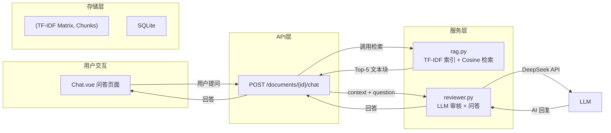

# RAG 检索增强生成与 TF-IDF 向量检索技术解析

> **学习目标**：深入理解 RAG（检索增强生成）的完整技术链路，掌握 TF-IDF 向量检索的数学原理与工程实践，能够在文档审核系统中独立分析、优化检索效果。
>
> **完成标志**：能手算一个微型 TF-IDF 矩阵并解释 Cosine Similarity 的物理意义；能画出 RAG 完整数据流图；能独立分析检索效果并给出优化方案。

---

## 本章阅读约定

本文使用以下四种标记帮助你高效阅读：

| 标记 | 含义 |
|------|------|
| > **提示**： | 帮助理解的补充信息、技巧分享 |
| > **注意**： | 需要特别留意的配置项、易出错的操作 |
| > **避坑**： | 前人踩过的坑，帮你绕开 |
| > **验证**： | 阶段性检查点，确认你做对了 |

文中命令统一使用 **macOS/Linux 终端** 和 **Windows PowerShell** 双标注。`<xxx>` 表示需要替换为你自己的实际内容。

---

## 学习地图

在开始之前，先建立对本教程的整体认知：

```
第一部分 → RAG 技术全景
   为什么大模型需要"外挂知识库"？RAG 三步拆解

第二部分 → TF-IDF 原理深度解析 ★ 核心
   文本→数字→相似度，从数学公式到 Python 代码

第三部分 → 文档分块策略
   chunk_size 怎么定？overlap 为什么重要？

第四部分 → 在文档审核系统中的实战
   绑定 Day2/3 项目的 rag.py/reviewer.py 代码走读

第五部分 → TF-IDF vs Embedding 与进阶方向
   什么时候该换 Embedding？混合检索怎么搭？
```

> **提示**：如果你是 Day2/3 实训学生，建议优先读第四部分（实战），对照项目代码加深理解。如果你是独立学习者，建议从头按顺序阅读——每个概念都从零讲起，不依赖 Day2/3 前序知识。

---

## 前言

### 为什么需要专门讲 RAG 和 TF-IDF

在 Day2 和 Day3 的实训中，你写了一个 `rag.py`，调了 `TfidfVectorizer`，跑了 `cosine_similarity`。代码跑通了、审核结果出来了——但停下来问自己三个问题：

1. **TF-IDF 到底把文本变成了什么？** 那个 `(N, 5000)` 的稀疏矩阵里每个数字代表什么？
2. **为什么搜"违约责任"能找到"违约金条款"？** 如果它其实"不理解"语义，那它是怎么做到的？
3. **如果被问到"TF-IDF 和 Embedding 有什么区别"**，你能在 30 秒内给出一个结构清晰、有公式、有代码、有场景对比的回答吗？

如果有一个问题你犹豫了——这篇教程就是为你写的。

> **比喻**：写 `rag.py` 跑通审核心跳加速的那一刻，就像第一次发动汽车——你会踩油门了，但你还不知道发动机怎么工作。这篇教程是"打开引擎盖"，让你看到活塞、火花塞和变速箱是怎么协同的。

### 你将学到什么

| 核心能力 | 具体表现 |
|---------|---------|
| **TF-IDF 数学推导** | 能手动计算 3 篇文档 × 5 个词的 TF-IDF 矩阵，解释每个数字的来源 |
| **Cosine Similarity 直觉** | 能说出"余弦相似度 0.95"在两段合同文本情境下意味着什么 |
| **RAG 架构设计** | 能画出检索→增强→生成三阶段的数据流图，标注每一步的输入输出 |
| **分块策略决策** | 能根据文档类型（合同/论文/聊天记录）选择合适的分块方案 |
| **技术选型论证** | 能在 30 秒内清晰对比 TF-IDF vs Embedding，给出选型建议 |

### 学习建议

1. **第二部分不要跳**：TF-IDF 是整个 RAG 系统的"地基"，跳过去直接看代码就像背答案不理解公式——被追问一句就暴露
2. **2.3 节一定动手算**：拿张草稿纸，跟着教程算一遍 TF-IDF 矩阵。肌肉记忆远强于眼睛记忆
3. **第四部分打开项目代码对照读**：每个"代码走读"片段，在你自己的 `rag.py` 里找到对应代码行

---

## 第一部分：RAG 技术全景

> **本部分目标**：建立对 RAG 的全局认知——它解决什么问题、核心机制是什么、在什么场景下该用它。

### 1.1 大模型的"知识边界"——为什么需要 RAG

大语言模型（LLM）很强大，但它有一个根本性的局限：**知识截止在训练数据的时间点**。DeepSeek-V3 不知道你昨天刚签的合同内容，Claude 不知道你公司内部的采购流程规范。

除此之外，LLM 还有三个"硬伤"：

```
硬伤 1：幻觉（Hallucination）
  你问"我们公司的保密条款第 3.2 条是什么？"
  LLM 不知道答案，但它不会说"我不知道"——它会编一段看起来合理的内容
  → 在法律场景下，编造的合同条款可能引发实际损失

硬伤 2：知识无法更新
  《个人信息保护法》2021 年 11 月实施
  如果 LLM 训练数据截止在 2021 年 6 月，它不知道这部法律
  → 用它审核用户协议，可能漏掉数据合规问题

硬伤 3：私有知识"喂不进去"
  一份 200 页的采购合同，Token 量远超上下文窗口
  即使塞进去了，LLM 对长篇文档中部的信息注意力衰减严重
  → "Lost in the Middle" 问题
```

> **比喻**：LLM 像一个从出生就被关在图书馆里读了 30 年书的人——他满腹经纶，但你问他"今天食堂吃什么"，他不知道，因为这个信息不在图书馆的藏书里。RAG 就是给他一扇窗户，让他能看到图书馆外面的实时信息。

### 1.2 RAG 是什么：检索 + 增强 + 生成 三步拆解

RAG（Retrieval-Augmented Generation，检索增强生成）的核心思想很简单：**问 LLM 之前，先帮它找到相关资料，把资料和问题一起喂给它**。

```
传统 LLM 调用：
  用户提问 → LLM → 回答（基于训练数据，可能幻觉）

RAG 流程：
  用户提问 → 检索（从知识库找相关文档）→ 增强（拼接问题和检索结果）
           → LLM（基于检索结果回答）→ 回答（有据可查，可溯源）
```

**三步逐层拆解：**

| 阶段 | 做什么 | 输入 | 输出 | 关键技术 |
|------|--------|------|------|---------|
| **Retrieval（检索）** | 从文档库中找到与问题最相关的片段 | 用户问题 | Top-K 相关文本块 | TF-IDF / Embedding / BM25 |
| **Augmentation（增强）** | 将检索结果与原始问题拼接成一个 Prompt | 问题 + 检索结果 | 增强后的完整 Prompt | Prompt 模板设计 |
| **Generation（生成）** | LLM 基于增强后的 Prompt 生成答案 | 增强 Prompt | 有据可查的回答 | DeepSeek / GPT / Claude |

> **比喻**：RAG = 开卷考试。闭卷考试（纯 LLM）= 只能靠记忆答题，忘了就是忘了。开卷考试（RAG）= 先翻书找相关内容，再基于找到的内容作答。答案可以追溯到"书的哪一页"。

**在文档审核系统中的应用映射：**

```
用户提问 "这份合同的违约责任是怎么约定的？"
         ↓
检索（rag.py retrieve_context）：从合同文本块中找到与"违约责任"最相关的 5 个片段
         ↓
增强（reviewer.py / chat_chain）：Prompt = "以下是与问题相关的合同片段：{检索结果}。用户问题：{问题}。请基于以上文档内容回答。"
         ↓
生成（DeepSeek API）："根据合同第 8.2 条，违约责任约定如下：逾期付款按日万分之五计收违约金……"
```

### 1.3 RAG vs 微调 vs 长上下文：三大方案对比

当你需要让 LLM "知道"新知识时，有三种主流方案。它们不是互斥的——实际生产中往往组合使用。

| 维度 | RAG | 微调（Fine-tuning） | 长上下文窗口 |
|------|-----|-------------------|------------|
| **原理** | 检索外部知识，拼接 Prompt | 用新数据继续训练模型参数 | 一次性把所有资料放进 Prompt |
| **知识更新** | 实时——更新知识库即刻生效 | 需要重新训练，耗时+费 GPU | 无需更新，每次传入新资料 |
| **成本** | 低——只需检索+推理 | 高——需要 GPU 训练 | 中——长 Prompt 的 Token 费用高 |
| **可解释性** | 高——能追溯到检索到的原文 | 低——模型参数是"黑盒" | 中——资料在 Prompt 里但 LLM 未必"注意"到 |
| **适用场景** | 知识库大、更新频繁、需溯源 | 领域特化任务、风格一致性 | 知识量小、需要全局理解 |
| **局限** | 检索质量决定回答质量 | 过时快、可能遗忘原有知识 | 注意力衰减、"Lost in the Middle" |

> **提示**：Day2/3 的文档审核系统用的是 **纯 RAG**。Day4 会讨论 RAG + 微调的组合——比如用企业内部的合同审核标准微调一个"专属法务模型"，再审合同时既懂法律常识（微调知识），又能查到具体合同内容（RAG 检索）。

**选型决策树：**

```
知识需要频繁更新吗？
  ├── 是 → RAG（更新知识库成本为零）
  └── 否 → 继续判断

数据量超过 10 万 Token 吗？
  ├── 是 → RAG（长上下文太长会导致注意力和成本问题）
  └── 否 → 继续判断

需要追溯答案来源吗？
  ├── 是 → RAG（检索结果天然可溯源）
  └── 否 → 长上下文或微调均可

需要模型掌握新的"思维方式"而不只是新知识吗？
  ├── 是 → 微调（RAG 不能改变模型的推理模式）
  └── 否 → RAG 就够了
```

### 1.4 RAG 的应用场景全景图

| 场景 | 知识库内容 | RAG 价值 | 实例 |
|------|-----------|---------|------|
| **法律合同审核** | 合同全文 + 法规库 + 历史判例 | 审查依据可溯源到具体条款 | **本项目** |
| **客服机器人** | 产品文档 + FAQ + 历史工单 | 回答有据可查，减少幻觉 | 电商售后咨询 |
| **企业知识库问答** | 内部 Wiki + SOP + 制度文件 | 新人自助查询，减少重复答疑 | "年假怎么算？" |
| **学术论文辅助** | 论文全文 + 参考文献 | 综述生成、跨文献对比 | 文献调研 |
| **代码库问答** | 代码仓库 + API 文档 | 理解大型代码库、定位功能 | "这个项目的认证逻辑在哪？" |
| **医疗辅助诊断** | 病历 + 诊疗指南 + 药典 | 结合患者数据给出建议 | 罕见病文献检索 |

---

## 第二部分：TF-IDF 原理解析 

> **本部分目标**：理解 TF-IDF 是什么、为什么这样设计、以及它在文档审核系统中怎么用。不需要背公式，重在建立直觉。

### 2.1 文本如何变成数字——向量化入门

计算机不懂中文。"违约责任"这四个字在计算机眼里只是一串 Unicode 编码。要让计算机"理解"文本内容，第一步是把文本转换成数字——这个过程叫**向量化**（Vectorization）。

```
文本: "甲方应在收到货物后30个工作日内完成验收。违约责任：逾期付款按日万分之五计收违约金。"

向量化后的形态（简化示意）：
  违约  0.35  ← 这个词的权重最高
  责任  0.28
  逾期  0.22
  付款  0.15
  验收  0.10
  甲方  0.05
  ...
  共 5000+ 维
```

本质上，向量化回答了：**"这篇文档里，每个词有多重要？"**

> **比喻**：向量化 = 给书编索引。一本 500 页的书，索引列出了所有重要关键词在哪一页。向量化不仅记录"出现没出现"，还记录"有多重要"。

### 2.2 TF-IDF 的核心思想：TF × IDF

TF-IDF 是 Term Frequency - Inverse Document Frequency 的缩写。它的逻辑很简单，两个问题决定一个词的权重：

**TF（词频）："这词在这篇文档里出现得多吗？"**

出现次数越多 → TF 越高 → 越能代表这篇文档。

> **比喻**：一篇足球新闻里，"进球"出现 15 次，"烹饪"出现 0 次。"进球"的 TF 高，说明这篇文档和足球强相关。

但光看 TF 不够。"的""是""在"在每个文档里都高频——TF 很高但不携带任何信息量。

**IDF（逆文档频率）："这词在所有文档里有多稀有？"**

只在少数文档中出现 → IDF 越高 → 区分能力越强。

> **比喻**：全校点名，"张伟"有 5 个——区分度低。"欧阳致远"只有一个——一说就知道是谁。IDF 就是度量这种"独特性"。

**TF-IDF = TF × IDF**

一个词要拿到高分，必须**同时满足**：
- 在这篇文档里大量出现（TF 高）
- 在其他文档里很少出现（IDF 高）

这正是"关键词"的定义——在一篇文档里频繁出现、但放在整个文档库里又比较独特。

> **提示**：在 sklearn 的 `TfidfVectorizer` 中，实际输出还会经过 L2 归一化，让每个文档向量的长度统一为 1。这样长文档和短文档才能公平比较——后面 2.4 节会解释。

### 2.3 一个具体例子：看 TF-IDF 怎么给词打分

设知识库中有 3 个合同文本块：

```
块1（关于违约）: "违约责任 逾期 付款 违约金"
块2（关于验收）: "验收 标准 质量 合格 验收"
块3（混合内容）: "违约 责任 验收 标准 付款"
```

**Step 1：建立词表**（所有不重复的词，共 9 个）

**Step 2：计算每个词的 TF-IDF 分**

以"违约金"为例：它只在块 1 出现 1 次，块 1 共 4 个词 → TF = 1/4 = 0.25。在 3 个块中只在 1 个出现 → IDF = log(3/2) ≈ 0.176。TF-IDF = 0.25 × 0.176 ≈ **0.044**。

以"付款"为例：它在块 1 出现 1 次，在块 3 出现 1 次 → TF 不低，但**3 个块中有 2 个都含此词** → IDF = log(3/3) = **0**。TF-IDF = **0**。

**直接看结论表**（TF-IDF > 0 的加粗）：

| 词 | 块1（违约主题） | 块2（验收主题） | 块3（混合） |
|----|:-----------:|:-----------:|:--------:|
| **逾期** | **0.044** | 0 | 0 |
| **违约金** | **0.044** | 0 | 0 |
| **质量** | 0 | **0.035** | 0 |
| **合格** | 0 | **0.035** | 0 |

> **验证**："逾期""违约金"只在块 1 出现 → 块 1 的代表词。"质量""合格"只在块 2 出现 → 块 2 的代表词。块 3 是混合内容，没有独有词，所有词的 TF-IDF 都是 0——**这块内容和其他块"太像了"，没有区分度**。

这个例子揭示 TF-IDF 的核心逻辑：**只有"在某篇文档中高频、且在其他文档中稀有"的词，才获得高分**。

> **注意**：sklearn 实际输出还会经过 L2 归一化和子线性缩放，数字会有差异。这里的手算忽略这些细节，重在理解"谁高谁低、为什么"。

### 2.4 Cosine Similarity：如何度量"两段文本有多像"

有了向量，下一个问题是：用户输入"违约责任"，计算机怎么找到最相关的文本块？

关键洞察：**度量"方向"而不是"距离"**。

```
欧氏距离（不好）："违约"向量长度 1，"违约 违约 违约"向量长度 3
  → 欧氏距离 = 2（很大），但两段文本主题完全相同！
  
余弦相似度（好）：看两个向量的方向夹角
  → [1] 和 [3] 方向一致 → 相似度 1.0（高度相关）
```

> **比喻**：两辆车都往东开，一辆 50km/h，一辆 100km/h。欧氏距离说"它们差很远"（速度差一倍），余弦相似度说"方向一致"。检索场景下，我们关心的是"话题方向"是否相同，不在乎文档长短。

**怎么算**（不需要记住，理解即可）：

$$\text{相似度} = \frac{两个向量在各个维度上的乘积之和}{两个向量各自长度的乘积}$$

- 结果范围 [0, 1]
- **1.0** = 完全相同的词频分布 → 内容高度相关
- **0.0** = 没有共享任何词 → 内容无关

在 Python 中，sklearn 已经封装好了，一行代码调用：
```python
from sklearn.metrics.pairwise import cosine_similarity
similarities = cosine_similarity(query_vector, tfidf_matrix)
```

### 2.5 项目中三个关键参数的解释

回顾 Day2 创建 `rag.py` 时的代码：

```python
vectorizer = TfidfVectorizer(
    analyzer='char_wb',    # ① 怎么"拆"中文文本
    ngram_range=(2, 4),    # ② 拆多长
    max_features=5000,     # ③ 保留多少
)
```

**① `analyzer='char_wb'` —— 中文分词的问题**

英文有空格，直接按空格拆词。中文没有空格，`analyzer='word'` 会把整句话当"一个词"。`'char_wb'` 的解决思路很巧妙：**按标点/空格把句子分段，在每段内部取连续 2-4 个字符的组合**。

> **比喻**：`'char'` = 把整本书字与字之间全部两两组合，会产生大量无意义的搭配。`'char_wb'` = 只在同一句话内部组合，不跨标点。

**② `ngram_range=(2, 4)` —— 同时用 2/3/4 字组合**

- 2-gram："违约"、"约责"、"责任"——捕获双字词
- 3-gram："违约金"——捕获三字术语
- 4-gram："违约责任"——捕获四字固定搭配

这套组合让 TF-IDF 不需要了解中文分词规则，就能覆盖多数合同术语。

**③ `max_features=5000` —— 别让向量太大**

每个文档被表示为一个 5000 维的向量，sklearn 只保留最重要的前 5000 个 n-gram。

> **避坑**：太小 → 关键特征丢失。太大 → 计算变慢、内存占用增加。5000 对合同文档是一个经验平衡点。

### 2.6 TF-IDF 的优势与天花板

#### 优势

| 优势 | 为什么重要 |
|------|----------|
| **零依赖** | pip install scikit-learn 即可，不用 GPU，不用下载模型 |
| **可解释** | 高分特征直接对应具体字符组合，能说清"为什么这段被检索到" |
| **快速** | 几千篇文档毫秒级响应 |
| **确定性** | 同样输入永远同样输出，不像 Embedding 模型会因版本更新而结果不同 |

#### 天花板

| 局限 | 例子 |
|------|------|
| **不懂词序** | "甲方赔偿乙方"和"乙方赔偿甲方"→ TF-IDF 认为高度相似，意思却完全相反 |
| **不懂同义词** | 搜"违约责任"找不到"违约金条款"——因为没共享 n-gram |
| **不认识新词** | 查询中的"解约金"不在词表里，直接被忽略 |
| **长文档退化** | 200 页合同审完，大部分词在大部分块中都出现，IDF 的区分度趋于 0 |

> **注意**：这些"天花板"不是 bug——是 TF-IDF 作为纯统计方法的固有取舍。Day4 引入 Embedding 向量检索，正是为了突破"语义盲区"和"不懂同义词"这两个核心问题。

---

## 第三部分：文档分块策略

> **本部分目标**：理解文档分块的必要性、关键参数的设计权衡、以及不同分块策略的适用场景。

### 3.1 为什么必须分块——上下文窗口的经济学

把文档分块（Chunking）不是 RAG 的可选项，而是必选项。原因涉及两个维度：

**维度一：Token 限制**

DeepSeek-V3 的上下文窗口是 128K Token。一份 200 页的合同大约 15-20 万 Token——看起来刚好装得下。但问题是：

- 128K Token 的 API 调用成本远高于 8K Token（按 Token 计价）
- 即使塞得下，LLM 对长篇文档中部的信息"注意力衰减"严重
- 每次对话都传入全文 → 每次调用 Token 消耗都很大 → 成本失控

**维度二：检索精度**

全文档检索 = 大海捞针。用户问"违约责任"，最相关的 2 段在 200 页文档的第 47 页和第 112 页。不分块的话，你只能返回"这份 200 页的合同"，让 LLM 自己去翻——既贵又不准。

> **比喻**：不分块 = 去图书馆查资料，管理员把整座图书馆的钥匙给你说"你自己找"。分块 = 管理员帮你把相关的 3 本书取出来放在桌上。

### 3.2 chunk_size 与 overlap 的权衡

回顾 Day2 项目中 `rag.py` 的分块参数：

```python
# rag.py 中的分块实现（伪代码示意）
chunk_size = 500   # 每个块 500 个字符
overlap = 100      # 相邻块之间重叠 100 个字符

def split_text(text):
    chunks = []
    start = 0
    while start < len(text):
        end = start + chunk_size
        chunks.append(text[start:end])
        start = end - overlap  # 下一块从 (当前末尾 - overlap) 开始
    return chunks
```

**visual 示意：**

```
文本: [A B C D E F G H I J K L M N O P Q R S T...]
       |---- chunk_size=500 ----|
                |---- chunk_size=500 ----|
                              |---- chunk_size=500 ----|
            ↑ overlap=100 ↑        ↑ overlap=100 ↑
```

#### chunk_size 的影响

| chunk_size | 优势 | 劣势 | 适用场景 |
|-----------|------|------|---------|
| **小（200-300）** | 检索精度高，精准定位 | 信息碎片化，上下文不足 | 法条检索、FAQ 匹配 |
| **中（500-800）** | 平衡精度和上下文 | — | **合同审核（本项目默认）** |
| **大（1500-2000）** | 上下文完整，一条条款不跨块 | 检索精度下降，噪音多 | 论文摘要、全面理解 |

> **避坑**：chunk_size=500 意味着一个块大约覆盖合同的一个条款。如果改成 2000，一条风险条款可能和几十条无关条款挤在一起传给 LLM——检索精度降低，LLM 被噪音干扰。

#### overlap 的作用

overlap = 100 意味着相邻两个块之间有 100 个字符的"重叠区"。**防止关键信息恰好被切在边界上。**

```
无 overlap：
  块1: "......违约金比例为合同总金额的" ← 切断了！
  块2: "80%，逾期超过30天每日增加1%......" ← LLM 看到这句话一头雾水

有 overlap（100 字符）：
  块1: "......违约金比例为合同总金额的80%，逾期超过30天每日增加1%......" ← 完整
  块2: "......违约金比例为合同总金额的80%，逾期超过30天每日增加1%......" ← 完整
```

> **验证**：在你的项目中做一个实验——把 overlap 设为 0，对同一份合同重新构建索引，然后搜索"违约"。观察是否有些原本能命中的结果消失了——那些就是被边界切断的。

### 3.3 固定分块 vs 语义分块 vs 层级分块

| 策略 | 方法 | 优势 | 劣势 | 本项目阶段 |
|------|------|------|------|----------|
| **固定分块** | 按固定 chunk_size 切分 | 实现简单、性能稳定 | 可能在句子中间切断 | Day2 v1.0 / Day3 v2.0 |
| **语义分块** | 按段落/句子边界切分，保持语义完整性 | 每个块含义完整，LLM 理解更准 | 块大小不均匀，可能过长或过短 | Day4 引入 |
| **层级分块** | 文档→章节→段落→句子，多粒度索引 | 支持"先粗后细"检索 | 索引结构复杂，存储开销大 | Day4 讨论 |

> **提示**：Day2/3 使用的固定分块是 RAG 的"Hello World"级别实现。它的局限性在 Day3 第 6.1 节已经讨论过——"违约责任"搜不到"违约金条款"。Day4 会用语义分块 + Embedding 向量检索来解决这个问题。

---

## 第四部分：RAG 在文档审核系统中的实战

> **本部分目标**：将前三部分的理论映射到 Day2/3 项目的实际代码中。建议打开你的项目文件，对照阅读。

### 4.1 系统架构中的 RAG 定位

回顾 Day2 的 v1.0 架构图：



**RAG 在整个系统中承担的角色**：检索层。它是"用户问题"和"LLM 回答"之间的桥梁——没有它，问答功能就是一个通用聊天机器人，不知道你的合同里写了什么。

> **提示**：对比 Day3 的 v2.0 架构，RAG 的定位不变（仍在服务层），但编排方式变了——原来 `routers/chat.py` 直接调 `rag.retrieve_context()`，v2.0 改为 `chat_chain.invoke()` 统一编排。这正体现了"原子服务层不变，编排层升级"的分层设计理念。

### 4.2 TF-IDF 在项目中的两处使用

整个系统只有一个 `RAGService` 实例（`backend/app/services/rag.py`），在内存中维护一份 TF-IDF 索引矩阵，所有对该文档的操作共用这份索引。

**第一处：文档上传时构建索引。** 在 `routers/documents.py` 的 `POST /api/documents/upload` 端点中，parser 提取纯文本后，立即调用 `rag.build_index(text)`：先按 chunk_size=500、overlap=100 切分成文本块，再用 `TfidfVectorizer` 对所有块做 fit_transform，构建出 TF-IDF 矩阵。索引一旦建成就存于内存，后续检索直接复用，不需要重新向量化。

**第二处：用户问答时检索相关段落。** 在 `routers/chat.py` 的 `POST /api/documents/{id}/chat` 端点中，收到用户提问后调用 `rag.retrieve_context(question, top_k=5)`：将问题向量化后与所有文本块的 TF-IDF 向量做 cosine similarity，按相似度降序返回 top-5 个最相关的段落。这 5 个段落作为 context 拼入 Prompt，交给 DeepSeek 生成回答。

简单来说：**TF-IDF 负责"找到相关段落"，DeepSeek 负责"基于那些段落给出回答"**——检索和生成各司其职。

### 4.3 检索链路走读：rag.py 代码逐段解析

以下是项目中 `rag.py` 的核心逻辑（关键代码片段），逐段解析：

#### 4.3.1 文本分块（chunking）

```python
def _split_text(self, text: str) -> List[str]:
    """将长文本切分为有重叠的文本块"""
    chunks = []
    start = 0
    while start < len(text):
        end = start + self.chunk_size
        chunk = text[start:end]
        chunks.append(chunk)
        if end >= len(text):
            break
        start = end - self.overlap  # 下一块起点 = 当前终点 - 重叠量
    return chunks
```

**走读要点**：
- `end - self.overlap` 是分块的核心逻辑——不是从当前块的终点开始下一块，而是"倒回" overlap 个字符
- 这意味着 chunk_size=500, overlap=100 时，每个块的实际"增量"只有 400 个字符
- 一份 8000 字的文档会被切成约 `ceil(8000 / 400) = 20` 个块

#### 4.3.2 构建 TF-IDF 索引（indexing）

```python
def build_index(self, text: str):
    """对文本分块并构建 TF-IDF 索引"""
    self.chunks = self._split_text(text)

    self.vectorizer = TfidfVectorizer(
        analyzer='char_wb',
        ngram_range=(2, 4),
        max_features=5000,
    )
    self.tfidf_matrix = self.vectorizer.fit_transform(self.chunks)
    # tfidf_matrix 形状：(N个块, 5000个特征)
```

**走读要点**：
- `fit_transform()` 做了两件事：① `fit`：扫描所有块，构建 5000 维词表；② `transform`：将每个块转为 TF-IDF 向量
- 返回的是稀疏矩阵（大多数值为 0）——因为每个块只包含 5000 个特征中的一小部分
- `self.chunks` 列表和 `self.tfidf_matrix` 矩阵的**行号一一对应**——`tfidf_matrix[3]` 就是 `self.chunks[3]` 的向量

#### 4.3.3 检索（retrieval）

```python
def retrieve_context(self, query: str, top_k: int = 5) -> List[dict]:
    """根据查询检索最相关的文本块"""
    # Step 1：将查询文本向量化（使用已有的 vectorizer）
    query_vector = self.vectorizer.transform([query])

    # Step 2：计算查询向量和所有文本块向量的余弦相似度
    from sklearn.metrics.pairwise import cosine_similarity
    similarities = cosine_similarity(query_vector, self.tfidf_matrix)
    # similarities 形状：(1, N) → 一行 N 列，每个值是一个块的相似度

    # Step 3：按相似度降序排序，取 top_k
    top_indices = similarities[0].argsort()[-top_k:][::-1]  # 先升序取最后K个，再反转

    # Step 4：返回结果
    results = []
    for idx in top_indices:
        results.append({
            "content": self.chunks[idx],
            "score": float(similarities[0][idx]),
        })
    return results
```

**走读要点**：
- `self.vectorizer.transform([query])` 使用的是同一套词表（已 fit 过），查询中不在词表中的字符 n-gram 会被忽略
- `argsort()[-top_k:][::-1]` 是一个常用的"取 top-k"模式：先升序 → 取最后 k 个（最大的 k 个）→ 反转（降序）
- 返回的 `score` 是余弦相似度，范围 [0, 1]，**1.0 = 和查询完全一致的词频分布**

> **验证**：在你的项目中运行 Day2 第 5.2 节的验证命令：
> ```bash
> $ cd backend && python -c "
> from app.services.rag import RAGService
> rag = RAGService()
> text = '甲方应在收到货物后30个工作日内完成验收。违约责任：逾期付款按日万分之五计收违约金。'
> rag.build_index(text)
> results = rag.retrieve_context('违约责任')
> for r in results:
>     print(f'{r[\"score\"]:.3f} | {r[\"content\"][:60]}')
> "
> ```
> 确认第一条结果的 score 最高，且内容包含"违约"相关文本。

### 4.4 生成链路走读：reviewer.py → review_chain.py Prompt 设计

检索完成后，下一步是**生成**——将检索结果和用户问题拼接成 Prompt，发给 LLM。

#### 4.4.1 v1.0 的问答 Prompt（reviewer.py）

```python
# reviewer.py - chat() 方法中的 Prompt 构造（简化示意）
def chat(self, chunks, question, history):
    context = "\n\n".join([f"[片段{i+1}] {c['content']}" for i, c in enumerate(chunks)])

    system_prompt = "你是一位专业法务助手，基于给定的合同文档内容回答用户问题。"
    user_prompt = f"""以下是与用户问题相关的文档片段：
{context}

最近对话历史：
{history}

用户问题：{question}

请基于以上文档内容回答。如果文档中没有相关信息，请明确说明。"""

    response = self.client.chat.completions.create(
        model="deepseek-chat",
        messages=[
            {"role": "system", "content": system_prompt},
            {"role": "user", "content": user_prompt},
        ],
    )
    return response.choices[0].message.content
```

**Prompt 设计要点**：

| 要素 | 说明 | 为什么重要 |
|------|------|----------|
| `[片段1] [片段2]` 编号 | 让 LLM 知道哪些内容来自哪个块 | 可以在回答中说"根据片段2"增强可信度 |
| `如果文档中没有相关信息，请明确说明` | 防幻觉指令 | 降低 LLM "编造"答案的概率 |
| `最近对话历史` | 多轮对话的上下文 | 用户追问"那第三条呢？"，LLM 需要知道"第三条"指什么 |
| `{context}` 放在 `{question}` 前面 | 检索结果先于问题出现 | 让 LLM 先"阅读"再"作答"，减少幻觉 |

#### 4.4.2 v2.0 的 Prompt 模板化（chat.yaml + chat_chain.py）

Day3 将 Prompt 从代码迁移到 YAML 文件：

```yaml
# prompts/chat.yaml
system: |
  你是一位专业法务助手，基于给定的合同文档内容回答用户问题。
  你的回答应：
  - 准确基于文档内容，不编造不存在的信息
  - 引用原文关键句作为依据
  - 用清晰的中文表达，分点回答复杂问题
  - 如果文档中没有相关信息，诚实说明"文档中未涉及此内容"

human: |
  以下是与用户问题相关的文档片段：
  {context}

  最近对话历史：
  {history}

  用户问题：{question}

  请基于以上文档内容回答。
```

**模板化的价值**（回顾 Day3 第 5.2 节）：
- 法务人员改审核标准 → 直接改 YAML，不碰代码
- 不同文档类型可以用不同的模板（合同审核模板 vs 标书审核模板）
- 模板可以版本控制（GPT review.yaml v1.0 → v2.0 的变更可追溯）

> **避坑**：`{context}` 的内容来自 TF-IDF 检索结果。如果检索出的 top-5 文本块中有一块完全不相关（相似度 0.05 也被取进来了），LLM 可能被这段噪音干扰。**检索质量决定生成质量——Garbage In, Garbage Out。**

### 4.5 完整数据流：从用户提问到 AI 引用原文回答

把前面三个环节串起来，看一条完整的 RAG 问答链路：

```
用户输入："这份合同的违约责任是怎么约定的？"
    │
    ▼
┌─────────────────────────────────────────────────────┐
│ Step 1: 检索（Retrieval）                            │
│                                                      │
│ ① TfidfVectorizer.transform(["这份合同的违约责任..."]) │
│    → query_vector (1, 5000)                           │
│                                                      │
│ ② cosine_similarity(query_vector, tfidf_matrix)      │
│    → [0.82, 0.15, 0.71, 0.03, ..., 0.45]            │
│                                                      │
│ ③ argsort() → 取 top-5                               │
│    → 块3 (score 0.82), 块15 (0.71), 块7 (0.45), ...  │
│                                                      │
│ ④ 返回：[{"content": "第8条 违约责任...", "score":   │
│           0.82}, ...]                                 │
└────────────────────┬────────────────────────────────┘
                     │
                     ▼
┌─────────────────────────────────────────────────────┐
│ Step 2: 增强（Augmentation）                         │
│                                                      │
│ context = "                                            │
│ [片段1] 第8条 违约责任：8.1 乙方逾期交付...           │
│ [片段2] 第12条 违约金计算：逾期付款按日万分之五...     │
│ [片段3] 第15条 争议解决：因本合同产生的争议...        │
│ "                                                     │
│                                                      │
│ Prompt = chat.yaml.render({                           │
│   context: context,                                   │
│   history: [...],                                     │
│   question: "这份合同的违约责任是怎么约定的？"         │
│ })                                                    │
└────────────────────┬────────────────────────────────┘
                     │
                     ▼
┌─────────────────────────────────────────────────────┐
│ Step 3: 生成（Generation）                           │
│                                                      │
│ DeepSeek API 返回：                                   │
│ "根据合同第8条，违约责任的约定如下：                   │
│  1. 乙方逾期交付货物的，每逾期一日按合同总金额的       │
│     万分之五向甲方支付违约金（第8.1条）               │
│  2. 乙方交付的货物不符合验收标准的，甲方有权要求       │
│     退货或换货（第8.2条）                             │
│  值得注意的是，合同主要约定了乙方的违约责任，对甲方    │
│  的违约责任约定较少......"                            │
│                                                      │
│ → 写入 ChatMessage 表                                 │
│ → 返回给前端 Chat.vue 渲染                            │
└─────────────────────────────────────────────────────┘
```

> **验证**：在你的项目中打开浏览器，进入问答页面，打开浏览器开发者工具的 Network 标签，发一条提问。观察 POST /api/documents/{id}/chat 的 Request Payload 和 Response——你能看到完整的 RAG 链路数据。

---

## 第五部分：TF-IDF vs Embedding 与进阶方向

> **本部分目标**：理解 TF-IDF 的边界在哪里、什么时候该引入 Embedding 向量检索、以及 Day4 的混合检索架构设计。

### 5.1 TF-IDF vs Embedding 全面对比

| 对比维度 | TF-IDF | Embedding 向量 |
|---------|--------|---------------|
| **原理** | 统计 n-gram 在文档中的出现频率 | 用神经网络将文本映射到稠密向量空间 |
| **语义理解** | 无——只看字符 n-gram 是否共享 | 有——"违约责任"和"违约金条款"在向量空间中距离近 |
| **向量维度** | 稀疏高维（max_features=5000） | 稠密低维（通常 768 / 1024 / 1536 维） |
| **计算资源** | CPU 即可，sklearn 一行代码 | 需要 GPU 或专门的服务（如 text-embedding API） |
| **OOV 处理** | 无法处理——词表外的 n-gram 被忽略 | 可以——subword tokenization 天然处理 |
| **多语言** | 每种语言需独立处理（如 jieba 分词） | 多语言模型一次搞定 |
| **可解释性** | 高——能看到"哪个词导致了高分" | 低——向量是"黑盒" |
| **精度** | 中等——关键词匹配场景足够 | 高——语义理解场景更优 |
| **成本** | 零（开源库） | 部署模型或调用 API（按 Token 计费） |

> **比喻**：TF-IDF = 用关键词在 Ctrl+F 搜索（加了一点权重）。Embedding = 给每段文字画一个"语义坐标"，在这个坐标里，"甲壳虫"和"披头士"会靠得很近——即使它们没有一个字相同。

### 5.2 混合检索：关键词 + 语义 + Rerank

这是 Day4 的核心升级方向。TF-IDF 和 Embedding 不是互斥的——最先进的 RAG 系统通常采用**三阶段检索**：

```
阶段 1：粗筛（Embedding 语义检索）
  query → Embedding 向量 → 向量数据库 Top-100
  目的：从海量块中快速筛出"大概相关"的候选集

阶段 2：精排（TF-IDF + BM25 关键词检索）
  query → 对 Top-100 候选集做关键词匹配 → 综合打分
  目的：在候选集中挑出真正"精确匹配"的结果

阶段 3：Rerank（Cross-encoder 重排序）
  query + 每个候选块 → Cross-encoder 逐对打分 → Top-5
  目的：用更精准的模型做最终排序
```

```
                    ┌──────────────┐
  用户查询 ────────►│  Embedding   │ ──── Top-100 ────┐
                    │  语义粗筛    │                    │
                    └──────────────┘                    ▼
                                             ┌──────────────────┐
                                             │  TF-IDF + BM25   │
                                             │  关键词精排      │
                                             └──────┬───────────┘
                                                    │ Top-20
                                                    ▼
                                             ┌──────────────────┐
                                             │  Cross-encoder   │
                                             │  Rerank 重排序   │
                                             └──────┬───────────┘
                                                    │ Top-5
                                                    ▼
                                              传给 LLM
```

> **提示**：你手上的 v2.0 系统处于"阶段 0"——只用了 TF-IDF，一步到位取 Top-5。Day4 会加上 Embedding 粗筛。三个阶段不是一步到位的——根据实际精度需求和成本预算，逐步叠加。

### 5.3 Day 4 展望：多策略 RAG 架构

Day4 将围绕以下方向深度优化：

```
检索层优化：
  ├── 语义分块（Semantic Chunking）：按语义边界切分，避免在句子中间切断
  ├── 层级分块（Hierarchical Chunking）：文档→章节→段落→句子，先粗后细
  └── 混合检索（Hybrid Search）：Embedding + TF-IDF + Rerank

审核层优化：
  ├── Human-in-the-Loop：AI 初筛 → 置信度评估 → 低置信度转人工
  ├── 动态审核维度：根据文档类型（合同/标书/保密协议）激活不同维度
  └── 本地 Qwen 7B 私有化部署：敏感数据不出企业内网
```

---

## 附录 A：TF-IDF 计算公式速查

| 公式 | 说明 |
|------|------|
| $TF(t, d) = \frac{f_{t,d}}{\sum_{t'} f_{t',d}}$ | 词 t 在文档 d 中的词频 = 出现次数 / 文档总词数 |
| $IDF(t) = \log\frac{N}{1 + n_t}$ | 词 t 的逆文档频率 = log(文档总数 / (包含 t 的文档数 + 1)) |
| $TF\text{-}IDF(t, d) = TF(t, d) \times IDF(t)$ | 词 t 在文档 d 中的 TF-IDF 权重 |
| $\text{cos}(A, B) = \frac{A \cdot B}{\|A\| \cdot \|B\|}$ | 余弦相似度 = 向量内积 / (A 长度 × B 长度) |

sklearn `TfidfVectorizer` 默认附加处理：
- **L2 归一化**：每个文档向量除以自身的 L2 范数，使所有向量长度为 1
- **Sublinear TF**：将原始 TF 替换为 `1 + log(TF)`（默认关闭，需显式设置 `sublinear_tf=True`）

---

## 附录 B：rag.py 关键代码注释版

以下是 Day2/3 项目中 `rag.py` 的完整注释版本：

```python
import numpy as np
from sklearn.feature_extraction.text import TfidfVectorizer
from sklearn.metrics.pairwise import cosine_similarity
from typing import List


class RAGService:
    """
    RAG 检索服务
    职责：文本分块 + TF-IDF 向量化 + Cosine Similarity 检索
    比喻：图书管理员——负责把文档编目（索引），然后帮读者找到最相关的段落（检索）
    """

    def __init__(self, chunk_size: int = 500, overlap: int = 100):
        """
        参数说明：
        - chunk_size=500：每个文本块约 500 字符，覆盖合同中的一个条款
        - overlap=100：相邻块重叠 100 字符，防止关键信息被切在边界
        """
        self.chunk_size = chunk_size
        self.overlap = overlap
        self.chunks: List[str] = []                # 存储所有文本块
        self.vectorizer: TfidfVectorizer = None    # 向量化器（fit 后复用）
        self.tfidf_matrix = None                   # TF-IDF 矩阵 (N个块, 5000维)

    def _split_text(self, text: str) -> List[str]:
        """分块：滑动窗口，每次前进 (chunk_size - overlap) 个字符"""
        chunks = []
        start = 0
        while start < len(text):
            end = start + self.chunk_size
            chunk = text[start:end]
            chunks.append(chunk)
            if end >= len(text):
                break
            # 关键：下一块起点 = 当前终点 - overlap
            # 这意味着相邻块共享 overlap 个字符
            start = end - self.overlap
        return chunks

    def build_index(self, text: str):
        """
        构建索引：分块 → 向量化
        调用时机：文档上传成功后
        """
        self.chunks = self._split_text(text)

        # analyzer='char_wb' → 字符级 n-gram（只在"词边界"内取），对中文友好
        # ngram_range=(2,4) → 同时使用 2-gram / 3-gram / 4-gram
        # max_features=5000 → 只保留最重要的 5000 个特征
        self.vectorizer = TfidfVectorizer(
            analyzer='char_wb',
            ngram_range=(2, 4),
            max_features=5000,
        )

        # fit_transform 做了两件事：
        # 1. fit：扫描所有块，构建 5000 维特征词汇表
        # 2. transform：把每个块转换为长度为 5000 的 TF-IDF 向量
        self.tfidf_matrix = self.vectorizer.fit_transform(self.chunks)
        # tfidf_matrix 是 scipy 稀疏矩阵——大多数元素为 0（因为每个块只包含 5000 个特征中的一小部分）

    def retrieve_context(self, query: str, top_k: int = 5) -> List[dict]:
        """
        检索：查询向量化 → Cosine Similarity → 取 Top-K
        调用时机：用户提问时
        """
        if not self.chunks:
            return []

        # Step 1：用已有的 vectorizer 将查询文本向量化
        # 注意：用的是 transform() 不是 fit_transform()，复用已构建的词表
        query_vector = self.vectorizer.transform([query])

        # Step 2：余弦相似度计算
        # query_vector 形状 (1, 5000)，tfidf_matrix 形状 (N, 5000)
        # cosine_similarity 返回 (1, N)，每个值是一个块的相似度
        similarities = cosine_similarity(query_vector, self.tfidf_matrix)

        # Step 3：按相似度降序排列，取 top_k 个
        # argsort() 默认升序 → [-top_k:] 取最后 K 个（最大的）→ [::-1] 反转（降序）
        top_indices = similarities[0].argsort()[-top_k:][::-1]

        # Step 4：组装返回结果
        results = []
        for idx in top_indices:
            score = float(similarities[0][idx])
            if score > 0:  # 过滤相似度为 0 的结果
                results.append({
                    "content": self.chunks[idx],
                    "score": score,
                })
        return results

    def get_chunks(self) -> List[str]:
        """获取所有文本块（用于审核时传全文给 LLM）"""
        return self.chunks
```

---

## 附录 C：术语表

| 英文术语 | 中文释义 | 简要说明 |
|---------|---------|---------|
| **RAG** | 检索增强生成 | 先检索相关知识，再让 LLM 基于检索结果生成回答 |
| **TF-IDF** | 词频-逆文档频率 | 一种基于词频统计的文本向量化方法 |
| **TF** | 词频 | 某个词在文档中出现的频率 |
| **IDF** | 逆文档频率 | 衡量某个词在整个语料库中的"稀有度" |
| **Cosine Similarity** | 余弦相似度 | 通过计算两个向量夹角的余弦值来衡量相似程度 |
| **Chunking** | 文本分块 | 将长文本文档切分成较小的文本块 |
| **chunk_size** | 块大小 | 每个文本块包含的字符数 |
| **overlap** | 重叠量 | 相邻文本块之间共享的字符数 |
| **Embedding** | 嵌入向量 | 用神经网络将文本映射为稠密低维向量 |
| **char_wb** | 字符级词边界 n-gram | sklearn TfidfVectorizer 的一种分析模式，对中文友好 |
| **LCEL** | LangChain 表达式语言 | LangChain 中用 `\|` 管道符串联组件的语法 |
| **HITL** | 人机协同 | Human-in-the-Loop，AI 初筛后转人工复核的审核模式 |
| **OOV** | 未登录词 | Out of Vocabulary，不在已有词表中的词 |
| **Rerank** | 重排序 | 在初筛结果基础上用更精细的模型进行二次排序 |
| **Hallucination** | 幻觉 | LLM 生成看似合理但与事实不符的内容 |

---

> **教程完成！** 你现在应该能够：手算一个微型 TF-IDF 矩阵、解释 Cosine Similarity 的物理意义、画出 RAG 完整数据流图、独立分析检索效果并给出优化方案。接下来回到你的项目——打开 `rag.py`，对着附录 B 的注释一行行看过去，你会发现之前"跑通了但不太理解"的代码，现在有了清晰的数学和工程直觉。
>
> 如果还有概念不清楚——回看第二部分（TF-IDF 原理），特别是 2.3 节（动手算一遍）。**纸上算过的公式，比屏幕上看过的代码，记得牢十倍。**
